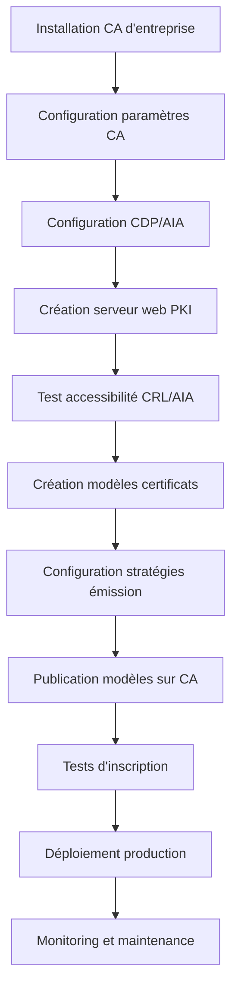

## 📑 Table des matières

```table-of-contents
title: 
style: nestedList # TOC style (nestedList|nestedOrderedList|inlineFirstLevel)
minLevel: 2 # Include headings from the specified level
maxLevel: 2 # Include headings up to the specified level
include: 
exclude: 
includeLinks: true # Make headings clickable
hideWhenEmpty: false # Hide TOC if no headings are found
debugInConsole: false # Print debug info in Obsidian console
```

---

## 🔧 Paramètres de la CA

### Vue d'ensemble

Les paramètres de la CA d'entreprise définissent le comportement global de l'autorité de certification, notamment la durée de validité des certificats, les algorithmes cryptographiques utilisés, et les politiques de renouvellement. Ces paramètres sont essentiels car ils déterminent le niveau de sécurité et la fiabilité de l'infrastructure PKI.

> [!info] Pourquoi configurer les paramètres de la CA ?
> 
> - Définir la durée de vie maximale des certificats émis
> - Choisir les algorithmes de signature appropriés
> - Configurer les périodes de validité des CRL
> - Établir les politiques de révocation et d'archivage

### Accès aux propriétés de la CA

Pour accéder aux paramètres de la CA :

1. Ouvrir la console **Autorité de certification** (`certsrv.msc`)
2. Clic droit sur le nom de la CA → **Propriétés**

### Onglet Général

Cet onglet affiche les informations de base de la CA et permet de visualiser son certificat.

**Informations disponibles :**

- Nom de la CA
- Certificat de la CA avec sa période de validité
- Algorithme de signature utilisé
- Emplacement du magasin de certificats

> [!tip] Astuce de vérification Utilisez le bouton **Afficher le certificat** pour vérifier la chaîne de confiance et les détails cryptographiques de votre CA.

### Onglet Stratégie de module

Configure le comportement du module de stratégie qui gère les demandes de certificats.

**Paramètres principaux :**

|Paramètre|Description|Recommandation|
|---|---|---|
|Action à effectuer pour les demandes entrantes|Définit si les demandes sont approuvées automatiquement ou manuellement|Automatique pour CA d'entreprise, Manuel pour CA racine|
|Supprimer les demandes en attente après X jours|Nettoie automatiquement les demandes obsolètes|30 jours (valeur par défaut)|

```powershell
# Configurer la stratégie de module via PowerShell
certutil -setreg policy\RequestDisposition 0
# 0 = En attente (manuel)
# 1 = Approuvé automatiquement
# 2 = Refusé automatiquement

# Redémarrer le service pour appliquer les modifications
Restart-Service certsvc
```

> [!warning] Attention Modifier la stratégie d'approbation automatique peut exposer votre PKI à des risques si les contrôles d'accès Active Directory ne sont pas correctement configurés.

### Onglet Sortie

Contrôle les options d'audit et de journalisation de la CA.

**Options disponibles :**

- **Format de base de données** : Définit comment les certificats sont stockés
- **Journalisation d'audit** : Active l'audit des événements CA
- **Taille maximale de la base de données** : Limite la croissance de la base de données CA

```powershell
# Activer l'audit complet
certutil -setreg CA\AuditFilter 127

# Afficher les paramètres actuels
certutil -getreg CA\AuditFilter

# Valeurs d'audit (peuvent être combinées) :
# 1 = Démarrage et arrêt de la CA
# 2 = Sauvegarde et restauration
# 4 = Émission et gestion des certificats
# 8 = Gestion des révocations
# 16 = Modifications de propriétés
# 32 = Gestion des modèles
# 64 = Importation/exportation de clés
```

### Onglet Extensions

Configure les extensions critiques des certificats, notamment les points de distribution CRL et AIA (traités en détail plus loin).

### Onglet Paramètres de stockage

Définit l'emplacement de la base de données et des fichiers journaux de la CA.

**Emplacements par défaut :**

- Base de données : `%SystemRoot%\System32\CertLog`
- Journaux : `%SystemRoot%\System32\CertLog`

```powershell
# Modifier l'emplacement de la base de données
certutil -setreg CA\DBDirectory "D:\CertData\Database"
certutil -setreg CA\DBLogDirectory "D:\CertData\Logs"

# Attention : nécessite un arrêt de service et une copie manuelle des fichiers
```

> [!warning] Changement d'emplacement Avant de modifier les chemins, arrêtez le service CA, copiez les fichiers existants vers le nouvel emplacement, puis redémarrez le service.

### Onglet Sécurité

Gère les permissions d'accès à la CA et définit qui peut émettre, gérer ou auditer les certificats.

**Permissions principales :**

|Permission|Description|Utilisateurs typiques|
|---|---|---|
|Lire|Consulter les informations de la CA|Tous les utilisateurs authentifiés|
|Émettre et gérer les certificats|Approuver et émettre des certificats|Administrateurs CA|
|Gérer la CA|Configuration complète|Administrateurs d'entreprise|
|Demander des certificats|Soumettre des demandes|Utilisateurs, ordinateurs, services|

### Paramètres de validité

Configure la durée de vie des certificats émis par la CA.

```powershell
# Définir la période de validité par défaut pour les certificats
certutil -setreg CA\ValidityPeriod "Years"
certutil -setreg CA\ValidityPeriodUnits 2

# Unités possibles : Years, Months, Weeks, Days, Hours

# Période de validité des CRL
certutil -setreg CA\CRLPeriod "Weeks"
certutil -setreg CA\CRLPeriodUnits 1

# Période de recouvrement des CRL (delta CRL)
certutil -setreg CA\CRLDeltaPeriod "Days"
certutil -setreg CA\CRLDeltaPeriodUnits 1
```

> [!tip] Bonnes pratiques pour les périodes de validité
> 
> - **CA racine** : 10-20 ans
> - **CA subordonnée** : 5-10 ans
> - **Certificats de serveur** : 1-2 ans
> - **Certificats utilisateur** : 1 an
> - **CRL** : 1 semaine avec delta CRL de 1 jour

### Algorithmes cryptographiques

Bien que configurés lors de l'installation, vous pouvez vérifier et documenter les algorithmes utilisés.

```powershell
# Afficher l'algorithme de hachage de la CA
certutil -dump | findstr "Algorithm"

# Afficher les informations du certificat de la CA
certutil -ca.cert ca_cert.cer

# Vérifier les capacités cryptographiques
certutil -csplist
```

> [!info] Algorithmes recommandés (2024)
> 
> - **Signature** : SHA-256 minimum (SHA-384 ou SHA-512 pour haute sécurité)
> - **Clé RSA** : 2048 bits minimum (4096 bits recommandé pour CA racine)
> - **Clé ECDSA** : P-256 minimum (P-384 pour haute sécurité)

### Paramètres avancés

```powershell
# Activer l'archivage des clés privées
certutil -setreg CA\KRAUsedCount 1

# Configurer le nombre de signatures requises pour récupération
certutil -setreg CA\KRAMinSignatures 2

# Désactiver la compatibilité avec les anciennes versions
certutil -setreg CA\AllowDeprecatedAlgorithms 0

# Activer le mode FIPS (Federal Information Processing Standard)
certutil -setreg CA\FIPSAlgorithmPolicy 1
```

> [!warning] Pièges courants
> 
> - Ne pas redémarrer le service après modification des paramètres
> - Utiliser des périodes de validité de certificat supérieures à celle de la CA
> - Oublier de sauvegarder avant des modifications critiques
> - Ne pas documenter les modifications apportées

---

## 📋 Modèles de certificats

### Vue d'ensemble

Les modèles de certificats définissent les paramètres et les extensions qu'un certificat doit contenir lors de son émission. Ils permettent de standardiser la création de certificats en fonction de leur usage (authentification, chiffrement, signature de code, etc.). Les modèles sont stockés dans Active Directory et répliqués automatiquement dans toute la forêt.

> [!info] Pourquoi utiliser des modèles ?
> 
> - Standardiser les certificats pour des usages spécifiques
> - Contrôler qui peut demander quels types de certificats
> - Définir les extensions et les options cryptographiques
> - Automatiser l'inscription et le renouvellement
> - Maintenir la cohérence dans toute l'entreprise

### Types de modèles

|Type|Version|Caractéristiques|Modification|
|---|---|---|---|
|**Modèles V1**|Windows 2000|Modèles de base prédéfinis|Non modifiable, uniquement duplication|
|**Modèles V2**|Windows 2003+|Modèles personnalisables|Modifiable, inscription automatique|
|**Modèles V3**|Windows 2008+|Support des algorithmes avancés (ECC, SHA-256+)|Modifiable, meilleure compatibilité|
|**Modèles V4**|Windows 2012+|Support des fournisseurs de stockage de clés (KSP)|Modifiable, compatibilité CNG complète|

> [!tip] Recommandation Utilisez les modèles V3 ou V4 pour toutes les nouvelles implémentations afin de bénéficier des algorithmes cryptographiques modernes et d'une meilleure sécurité.

### Console de gestion des modèles

Pour gérer les modèles de certificats :

```powershell
# Ouvrir la console de modèles de certificats
certtmpl.msc

# Ou depuis la console Autorité de certification
# Clic droit sur "Modèles de certificats" → Gérer
```

### Modèles prédéfinis courants

|Modèle|Usage|Type|Renouvellement auto|
|---|---|---|---|
|Computer|Authentification ordinateur|V1|Oui|
|User|Authentification utilisateur|V1|Oui|
|Web Server|Certificat SSL/TLS serveur|V1|Non|
|Code Signing|Signature de code|V1|Non|
|Domain Controller|Authentification DC|V2|Oui|
|Workstation Authentication|Auth. poste de travail|V2|Oui|

### Créer un modèle personnalisé

#### Méthode 1 : Duplication d'un modèle existant

1. Ouvrir `certtmpl.msc`
2. Clic droit sur un modèle similaire → **Dupliquer le modèle**
3. Choisir la version du modèle (Windows Server 2008 R2 ou supérieur recommandé)

```powershell
# Il n'existe pas de commande PowerShell native pour dupliquer un modèle
# Cette opération doit être effectuée via la console certtmpl.msc
```

> [!example] Exemple pratique Pour créer un modèle de certificat de serveur web personnalisé, dupliquez le modèle "Web Server" et personnalisez-le selon vos besoins.

### Onglet Général du modèle

Configure les propriétés de base du modèle.

**Paramètres principaux :**

- **Nom complet** : Nom affiché dans les interfaces
- **Nom du modèle** : Identificateur unique (non modifiable après création)
- **Période de validité** : Durée de vie du certificat émis
- **Période de renouvellement** : Délai avant expiration pour déclencher le renouvellement
- **Publier le certificat dans Active Directory** : Stockage du certificat dans l'annuaire

```powershell
# Afficher tous les modèles disponibles
certutil -CATemplates

# Afficher les détails d'un modèle spécifique
certutil -v -template "WebServer"

# Lister les modèles publiés sur une CA
certutil -catemplates
```

> [!warning] Attention aux noms Le nom du modèle (template name) est immuable après création. Choisissez un nom clair et descriptif dès le départ.

### Onglet Nom du sujet

Détermine comment le nom du sujet (Subject Name) et l'autre nom du sujet (Subject Alternative Name) sont construits.

**Options de configuration :**

|Option|Description|Usage typique|
|---|---|---|
|**Construire à partir de ces informations Active Directory**|Utilise les attributs AD|Certificats utilisateur/ordinateur|
|**Fournir dans la demande**|Le demandeur spécifie le nom|Certificats serveur web|
|**Utiliser les informations du sujet du certificat existant**|Pour les renouvellements|Renouvellement automatique|

**Format du nom de sujet :**

- Nom commun (CN)
- Nom distinctif complet (DN)
- Adresse e-mail uniquement

```powershell
# Exemple de vérification du nom de sujet d'un certificat
certutil -dump certificate.cer | findstr "Subject:"

# Format typique :
# Subject: CN=server.contoso.com, OU=IT, O=Contoso, C=US
```

**Configuration des SAN (Subject Alternative Names) :**

Les SAN permettent d'inclure plusieurs identités dans un certificat.

Types de SAN courants :

- **DNS** : noms de domaine (ex: www.contoso.com, mail.contoso.com)
- **UPN** : nom principal d'utilisateur (ex: utilisateur@contoso.com)
- **Email** : adresse e-mail
- **IP** : adresse IP

> [!tip] Bonnes pratiques pour les SAN
> 
> - Toujours inclure le nom commun (CN) également dans les SAN
> - Utilisez les SAN pour les certificats multi-domaines
> - Validez que l'application cible supporte les SAN

### Onglet Compatibilité

Définit la compatibilité avec différentes versions de systèmes d'exploitation.

**Paramètres clés :**

- **Autorité de certification** : Version minimale de Windows Server
- **Destinataire du certificat** : Version minimale du client

```powershell
# Vérifier la compatibilité cryptographique du système
certutil -csplist

# Afficher les fournisseurs de stockage de clés disponibles
certutil -csp
```

> [!info] Impact de la compatibilité
> 
> - **Version CA basse** : limite les algorithmes disponibles
> - **Version destinataire basse** : réduit les options de chiffrement
> - **Versions récentes** : permettent ECDSA, SHA-256+, et CNG

### Onglet Traitement de la demande

Configure comment les demandes de certificats sont traitées.

**Options principales :**

|Paramètre|Description|Valeur recommandée|
|---|---|---|
|**Objectif**|Usage du certificat|Signature, Chiffrement, ou les deux|
|**Autoriser l'exportation de la clé privée**|Sauvegarde de la clé|Non (sauf cas spécifiques)|
|**Archiver la clé privée du sujet**|Archivage sur la CA|Oui pour récupération|
|**Taille minimale de la clé**|Longueur de clé RSA/ECC|2048 bits minimum|
|**Fournisseur de services cryptographiques**|CSP ou KSP|KSP pour systèmes récents|

```powershell
# Demander un certificat avec exportation de clé privée
certreq -new -config "CA\Server" template.inf export.req

# Exemple de fichier INF pour demande personnalisée
[NewRequest]
Subject = "CN=WebServer.contoso.com"
KeyLength = 2048
Exportable = TRUE
MachineKeySet = TRUE
ProviderName = "Microsoft RSA SChannel Cryptographic Provider"

[RequestAttributes]
CertificateTemplate = "WebServer"
```

> [!warning] Sécurité des clés privées N'autorisez l'exportation des clés privées que lorsque c'est absolument nécessaire (sauvegarde, migration). Les clés exportables peuvent être compromises plus facilement.

### Onglet Cryptographie

Définit les paramètres cryptographiques avancés du modèle.

**Paramètres configurables :**

- **Catégorie de fournisseur** : Ancien style (CSP) ou CNG (KSP)
- **Algorithme de hachage** : SHA-256, SHA-384, SHA-512
- **Taille de clé minimale** : 1024, 2048, 4096 bits (RSA) ou 256, 384, 521 bits (ECC)
- **Demandes doivent utiliser l'un des fournisseurs suivants** : Liste des CSP/KSP autorisés

```powershell
# Lister les algorithmes de hachage supportés
certutil -oid 1.3.14.3.2 | findstr "sha"

# Fournisseurs CNG (Cryptography Next Generation)
# Microsoft Software Key Storage Provider
# Microsoft Smart Card Key Storage Provider
# Microsoft Platform Crypto Provider
```

> [!tip] Recommandations cryptographiques 2024
> 
> - **Algorithme de hachage** : SHA-256 minimum, SHA-384 pour haute sécurité
> - **Clé RSA** : 2048 bits minimum, 4096 bits pour CA et serveurs critiques
> - **Clé ECC** : P-256 minimum, P-384 pour haute sécurité
> - **Fournisseur** : Préférer les KSP (CNG) aux CSP legacy

### Onglet Extensions

Configure les extensions X.509 incluses dans les certificats.

**Extensions critiques principales :**

|Extension|Description|Valeur typique|
|---|---|---|
|**Utilisation de la clé**|Usage autorisé de la clé|Signature numérique, Chiffrement de clé|
|**Utilisation avancée de la clé (EKU)**|Objectifs spécifiques|Authentification serveur, Authentification client|
|**Stratégies d'application**|Politiques applicables|Varie selon l'usage|
|**Autre nom du sujet**|SAN (DNS, UPN, email)|Inclus si activé|

**Utilisation de la clé (Key Usage) :**

```
- Signature numérique (Digital Signature)
- Non-répudiation (Non-Repudiation)
- Chiffrement de clé (Key Encipherment)
- Chiffrement de données (Data Encipherment)
- Accord de clé (Key Agreement)
- Signature de certificat de CA (Key Cert Sign)
- Signature de CRL (CRL Sign)
- Chiffrement uniquement (Encipher Only)
- Déchiffrement uniquement (Decipher Only)
```

**Utilisation avancée de la clé (Enhanced Key Usage - EKU) :**

```powershell
# OID courants pour EKU
# 1.3.6.1.5.5.7.3.1 = Authentification de serveur (TLS/SSL)
# 1.3.6.1.5.5.7.3.2 = Authentification de client
# 1.3.6.1.5.5.7.3.3 = Signature de code
# 1.3.6.1.5.5.7.3.4 = Protection d'e-mail (S/MIME)
# 1.3.6.1.4.1.311.10.3.12 = Signature de document

# Afficher les OID EKU d'un certificat
certutil -dump cert.cer | findstr "Enhanced Key Usage"
```

> [!example] Configuration typique par type de certificat **Serveur Web** :
> 
> - Key Usage : Digital Signature, Key Encipherment
> - EKU : Server Authentication (1.3.6.1.5.5.7.3.1)
> 
> **Client/Utilisateur** :
> 
> - Key Usage : Digital Signature, Key Encipherment
> - EKU : Client Authentication (1.3.6.1.5.5.7.3.2)
> 
> **Signature de code** :
> 
> - Key Usage : Digital Signature
> - EKU : Code Signing (1.3.6.1.5.5.7.3.3)

### Onglet Sécurité du modèle

Définit les permissions d'accès au modèle de certificat.

**Permissions principales :**

|Permission|Description|Groupe typique|
|---|---|---|
|**Lire**|Voir le modèle|Utilisateurs authentifiés|
|**Inscription**|Demander un certificat|Utilisateurs, Ordinateurs|
|**Inscription automatique**|Renouvellement automatique|Ordinateurs du domaine|
|**Contrôle total**|Modifier le modèle|Administrateurs PKI|

```powershell
# Les permissions sont gérées via l'interface graphique
# Elles sont stockées dans Active Directory

# Vérifier les permissions sur un modèle
# (nécessite le module Active Directory)
Get-ADObject -Filter {cn -eq "WebServer"} -SearchBase "CN=Certificate Templates,CN=Public Key Services,CN=Services,CN=Configuration,DC=contoso,DC=com" -Properties nTSecurityDescriptor | Select-Object -ExpandProperty nTSecurityDescriptor | Format-List
```

> [!warning] Principe du moindre privilège N'accordez les permissions d'inscription qu'aux groupes qui ont réellement besoin de ce type de certificat. Une permission excessive peut créer des failles de sécurité.

### Onglet Conditions de délivrance

Configure les exigences pour l'émission d'un certificat basé sur ce modèle.

**Options disponibles :**

- **Nécessiter cette approbation pour l'inscription** : Requiert une validation manuelle
- **Nombre de signatures autorisées** : Signataires requis pour l'approbation
- **Type de stratégie requis dans la signature** : Application ou émission
- **Stratégie de demande valide** : OID de stratégie requis

```powershell
# Ces paramètres contrôlent le workflow d'approbation
# Configuration avancée via certutil

certutil -v -template "HighSecurityTemplate" | findstr "msPKI"
```

> [!info] Cas d'usage Les conditions de délivrance sont particulièrement utiles pour les certificats à haut niveau de sécurité (signature de code, administrateurs) où une validation humaine ou multiple est nécessaire.

### Publier un modèle sur la CA

Une fois le modèle créé, il doit être publié sur la CA pour être disponible.

**Via la console graphique :**

1. Ouvrir la console **Autorité de certification**
2. Développer la CA → Clic droit sur **Modèles de certificats**
3. **Nouveau** → **Modèle de certificat à délivrer**
4. Sélectionner le modèle créé → **OK**

**Via PowerShell :**

```powershell
# Ajouter un modèle à la CA
certutil -SetCATemplates +MonNouveauModele

# Supprimer un modèle de la CA
certutil -SetCATemplates -AncienModele

# Lister les modèles publiés
certutil -CATemplates
```

> [!tip] Vérification Après publication, vérifiez que le modèle apparaît bien dans la liste des certificats disponibles lors d'une demande.

### Gestion des versions de modèles

Les modèles peuvent être versionnés pour suivre les modifications.

```powershell
# Afficher la version d'un modèle
certutil -v -template "WebServer" | findstr "Version"

# Les modifications d'un modèle incrémentent automatiquement
# sa version dans Active Directory
```

**Bonnes pratiques de versioning :**

- Documentez chaque modification majeure
- Testez les nouvelles versions avant déploiement en production
- Conservez les anciennes versions pour compatibilité
- Utilisez des noms descriptifs pour les versions majeures

> [!warning] Pièges courants avec les modèles
> 
> - Oublier de publier le modèle sur la CA après création
> - Permissions de sécurité trop restrictives ou trop permissives
> - Périodes de validité supérieures à celle de la CA émettrice
> - Ne pas tester l'inscription avant déploiement en production
> - Utiliser des modèles V1 qui ne supportent pas l'inscription automatique

---

## 🛡️ Stratégies d'émission

### Vue d'ensemble

Les stratégies d'émission définissent les règles et conditions sous lesquelles une CA peut émettre des certificats. Elles permettent de contrôler qui peut obtenir quel type de certificat et sous quelles circonstances. Les stratégies assurent que seuls les certificats légitimes et conformes aux exigences de sécurité sont émis.

> [!info] Pourquoi des stratégies d'émission ?
> 
> - Contrôler l'accès aux certificats sensibles
> - Imposer des workflows d'approbation
> - Garantir la conformité avec les politiques de sécurité
> - Prévenir l'émission abusive de certificats
> - Documenter les exigences de validation

### Module de stratégie

Le module de stratégie est un composant logiciel de la CA qui traite les demandes de certificats et applique les règles d'émission.

**Module par défaut :** Enterprise and Stand-alone

**Fonctionnement :**

1. Réception d'une demande de certificat
2. Vérification des permissions et de l'identité du demandeur
3. Application des règles du modèle de certificat
4. Validation contre les stratégies configurées
5. Émission, mise en attente, ou refus du certificat

```powershell
# Afficher le module de stratégie actif
certutil -getconfig

# Afficher la configuration du module de stratégie
certutil -getreg policy\

# Afficher toutes les demandes en attente
certutil -view -restrict "Disposition=9" -out "RequestID,RequesterName,CommonName"
```

### Types de stratégies d'émission

#### 1. Stratégies basées sur l'identité

Contrôlent qui peut demander des certificats en fonction de l'authentification Active Directory.

**Mécanismes :**

- Appartenance à un groupe de sécurité
- Unité organisationnelle (OU)
- Attributs utilisateur/ordinateur
- Authentification forte (carte à puce, certificat)

```powershell
# Les permissions sont configurées dans l'onglet Sécurité du modèle
# Exemple : Seuls les membres du groupe "PKI-WebAdmins" peuvent
# demander des certificats "Internal Web Server"
```

> [!example] Exemple pratique Pour les certificats de serveur web, créez un groupe AD "WebServerAdmins" et accordez-lui la permission "Inscription" sur le modèle de certificat.

#### 2. Stratégies basées sur l'approbation manuelle

Requièrent une validation humaine avant l'émission du certificat.

**Configuration dans le modèle :**

- Onglet **Conditions de délivrance**
- Cocher "Nécessiter cette approbation pour l'inscription"
- Définir le nombre de signatures autorisées requises

```powershell
# Approuver une demande en attente (par RequestID)
certutil -resubmit 1234

# Refuser une demande
certutil -deny 1234

# Lister toutes les demandes en attente
certutil -view -restrict "Disposition=9"
```

**Workflow typique :**

1. L'utilisateur soumet une demande
2. La demande est mise en attente (statut "Pending")
3. Un administrateur CA examine la demande
4. L'administrateur approuve ou refuse la demande
5. Si approuvée, le certificat est émis

> [!tip] Cas d'usage pour approbation manuelle
> 
> - Certificats de signature de code
> - Certificats d'administrateur à privilèges élevés
> - Certificats de CA subordonnée
> - Certificats externes ou de partenaires

#### 3. Stratégies basées sur les attributs

Valident que certains attributs sont présents et corrects dans la demande.

**Attributs vérifiables :**

- Nom du sujet (Subject Name)
- Autre nom du sujet (SAN)
- Utilisation de la clé (Key Usage)
- Utilisation avancée de la clé (EKU)

**Configuration :**

- Définie dans le modèle de certificat
- Onglet "Nom du sujet" pour les attributs de nom
- Onglet "Extensions" pour les usages de clé

> [!warning] Validation stricte Si le modèle exige que le CN provienne d'Active Directory mais que la demande fournit un CN personnalisé, la demande sera refusée automatiquement.

#### 4. Stratégies de signature de demande

Requièrent que la demande de certificat soit signée par un ou plusieurs signataires autorisés.

**Configuration avancée :**

- Onglet "Conditions de délivrance" du modèle
- "Nombre de signatures autorisées" : 1, 2, ou plus
- "Type de stratégie requis dans la signature" : Application ou Émission

```powershell
# Pour signer une demande de certificat
certreq -sign request.req signed_request.req

# Soumettre une demande signée
certreq -submit -config "CA\Server" signed_request.req certificate.cer
```

> [!info] Signatures multiples Les signatures multiples renforcent la sécurité en imposant l'accord de plusieurs personnes autorisées (séparation des tâches).

### Configuration des stratégies dans la CA

#### Paramètres de restriction globaux

Les paramètres globaux de la CA peuvent restreindre l'émission de certificats.

```powershell
# Désactiver la compatibilité avec les anciens algorithmes
certutil -setreg CA\AllowDeprecatedAlgorithms 0

# Activer le mode FIPS
certutil -setreg CA\FIPSAlgorithmPolicy 1

# Configurer la longueur minimale de clé RSA (en bits)
certutil -setreg CA\MinimumKeySize 2048

# Redémarrer le service pour appliquer
Restart-Service certsvc
```

#### Filtres de demande

Les filtres permettent d'accepter ou de rejeter automatiquement certaines demandes.

```powershell
# Refuser les demandes avec des clés inférieures à 2048 bits
certutil -setreg policy\RequestDisposition 2
# 0 = En attente
# 1 = Émis
# 2 = Refusé

# Configurer des restrictions personnalisées via scripts
# Les scripts peuvent être appelés via le module de stratégie
```

### Stratégies OID (Object Identifier)

Les OID de stratégie identifient des ensembles de règles spécifiques applicables aux certificats.

**Structure d'un OID :**

```
1.3.6.1.4.1.311.21.8.XXXXXXXXX.XXXXXXXXX.XXXXXXXXX
```

**Utilisation :**

- Identifier le niveau d'assurance du certificat
- Spécifier les politiques de validation
- Lier à des documents de pratiques de certification (CPS)

```powershell
# Ajouter une stratégie d'émission personnalisée à un modèle
# (via l'interface graphique dans l'onglet Extensions)

# Vérifier les OID de stratégie d'un certificat
certutil -dump certificate.cer | findstr "Policy"
```

> [!example] Niveaux d'assurance typiques
> 
> - **Faible** : Validation automatique, peu de vérifications
> - **Moyen** : Validation AD, approbation conditionnelle
> - **Élevé** : Approbation manuelle, signatures multiples, validation renforcée

### Audit et conformité

Les stratégies d'émission doivent être auditées pour garantir leur respect.

```powershell
# Activer l'audit complet de la CA
certutil -setreg CA\AuditFilter 127

# Générer un rapport des certificats émis
certutil -view -out "RequestID,RequesterName,CommonName,NotBefore,NotAfter,CertificateTemplate" csv > certificates_issued.csv

# Exporter les demandes refusées
certutil -view -restrict "Disposition=31" -out "RequestID,RequesterName,CommonName,SubmittedWhen" csv > denied_requests.csv
```

**Événements à auditer :**

- Émissions de certificats
- Refus de demandes
- Révocations
- Modifications de configuration
- Tentatives d'accès non autorisées

> [!tip] Bonnes pratiques d'audit
> 
> - Activez l'audit complet dès le déploiement
> - Exportez régulièrement les journaux vers un SIEM
> - Revoyez périodiquement les certificats émis
> - Documentez toutes les exceptions aux stratégies

### Documentation des stratégies

Une PKI bien gérée nécessite une documentation formelle des stratégies.

**Documents essentiels :**

|Document|Contenu|Audience|
|---|---|---|
|**CP (Certificate Policy)**|Règles générales d'utilisation|Utilisateurs, auditeurs|
|**CPS (Certification Practice Statement)**|Procédures techniques détaillées|Administrateurs PKI|
|**Matrice des rôles et responsabilités**|Qui fait quoi|Équipe PKI|
|**Procédures d'approbation**|Workflow de validation|Approbateurs|

> [!warning] Pièges courants avec les stratégies
> 
> - Ne pas documenter les stratégies d'émission
> - Permissions trop permissives sur les modèles sensibles
> - Absence de séparation des tâches
> - Aucun audit des émissions de certificats
> - Stratégies trop complexes ou irréalistes

---

## 📍 Configuration des points de distribution CRL et AIA

### Vue d'ensemble

Les points de distribution CRL (Certificate Revocation List) et AIA (Authority Information Access) sont des extensions critiques des certificats qui permettent aux clients de vérifier la validité et la chaîne de confiance d'un certificat.

> [!info] Pourquoi configurer CRL et AIA ?
> 
> - **CRL** : Permet aux clients de vérifier si un certificat a été révoqué
> - **AIA** : Permet de récupérer le certificat de la CA émettrice pour construire la chaîne de confiance
> - **OCSP** : Alternative moderne et plus efficace aux CRL pour la vérification en ligne

### Concepts fondamentaux

#### CRL (Certificate Revocation List)

Liste des certificats révoqués publiée périodiquement par la CA.

**Caractéristiques :**

- Fichier signé par la CA contenant les numéros de série des certificats révoqués
- Publié selon un calendrier régulier (ex: toutes les semaines)
- Peut être volumineux pour les grandes PKI

**Types de CRL :**

|Type|Description|Fréquence de publication|
|---|---|---|
|**Base CRL**|Liste complète de tous les certificats révoqués|Hebdomadaire ou mensuelle|
|**Delta CRL**|Liste uniquement des nouvelles révocations depuis la dernière base CRL|Quotidienne ou horaire|

#### AIA (Authority Information Access)

Extension qui indique où obtenir le certificat de la CA émettrice.

**Utilisation :**

- Construction de la chaîne de certificats
- Validation de la signature du certificat
- Accès au certificat de la CA parente

#### CDP (CRL Distribution Point)

Extension qui indique où télécharger la CRL pour vérifier la révocation.

**Protocoles supportés :**

- **HTTP** : Accès web (recommandé)
- **LDAP** : Accès Active Directory
- **File** : Chemin UNC (usage interne uniquement)

### Accès à la configuration

```powershell
# Ouvrir la console Autorité de certification
certsrv.msc

# Clic droit sur la CA → Propriétés → Onglet Extensions
```

### Configuration des CRL Distribution Points (CDP)

#### Emplacements par défaut

Windows Server configure automatiquement des emplacements CDP lors de l'installation de la CA.

**Emplacements typiques :**

```
1. ldap:///CN=<CAName><CRLNameSuffix>,CN=<ServerShortName>,CN=CDP,CN=Public Key Services,CN=Services,<ConfigurationContainer><CDPObjectClass>

2. http://<ServerDNSName>/CertEnroll/<CAName><CRLNameSuffix><DeltaCRLAllowed>.crl

3. file://<ServerDNSName>/CertEnroll/<CAName><CRLNameSuffix><DeltaCRLAllowed>.crl
```

#### Variables de substitution

|Variable|Description|Exemple|
|---|---|---|
|`<CAName>`|Nom de la CA|ContosoRootCA|
|`<CRLNameSuffix>`|Suffixe du nom de CRL|(vide) ou (1)|
|`<DeltaCRLAllowed>`|Indique support Delta CRL|+Delta ou vide|
|`<ServerShortName>`|Nom NetBIOS du serveur|CASERVER|
|`<ServerDNSName>`|FQDN du serveur|ca.contoso.com|
|`<ConfigurationContainer>`|DN du conteneur de configuration|CN=Configuration,DC=contoso,DC=com|

#### Ajouter un CDP personnalisé

**Via l'interface graphique :**

1. **Propriétés de la CA** → Onglet **Extensions**
2. Sélectionner **CRL Distribution Point (CDP)**
3. Cliquer sur **Ajouter**
4. Entrer l'URL (ex: `http://pki.contoso.com/crl/<CAName><CRLNameSuffix><DeltaCRLAllowed>.crl`)
5. Cocher les cases appropriées :
    - ☑ **Inclure dans les CRL** : Publier la CRL à cet emplacement
    - ☑ **Inclure dans l'extension CDP des certificats émis** : Ajouter cette URL dans les certificats
    - ☐ **Inclure dans l'extension IDP de toutes les CRL publiées** : Pour les configurations avancées

```powershell
# Ajouter un CDP via PowerShell
certutil -setreg CA\CRLPublicationURLs "1:C:\Windows\System32\CertSrv\CertEnroll\%3%8%9.crl\n2:http://pki.contoso.com/crl/%3%8%9.crl"

# Publier la CRL immédiatement
certutil -CRL

# Vérifier les emplacements CDP configurés
certutil -getreg CA\CRLPublicationURLs
```

> [!warning] Attention aux options cochées
> 
> - **Inclure dans les CRL** : La CA doit pouvoir écrire à cet emplacement
> - **Inclure dans CDP des certificats** : L'emplacement doit être accessible par tous les clients
> - N'incluez JAMAIS de chemins UNC (`file://`) dans les certificats destinés à Internet

#### Bonnes pratiques CDP

**1. Utiliser HTTP pour l'accessibilité externe**

```
http://pki.contoso.com/crl/<CAName><CRLNameSuffix><DeltaCRLAllowed>.crl
```

**2. Utiliser LDAP pour l'accès interne**

```
ldap:///CN=<CAName><CRLNameSuffix>,CN=<ServerShortName>,CN=CDP,CN=Public Key Services,CN=Services,<ConfigurationContainer>
```

**3. Ordre des emplacements**

- Placer les emplacements les plus accessibles en premier
- Les clients tentent les emplacements dans l'ordre listé

**4. Redondance**

- Configurer au moins 2 emplacements CDP
- Utiliser des serveurs web distincts pour la haute disponibilité

> [!tip] Astuce pour les environnements multi-sites Utilisez un serveur web avec répartition de charge géographique ou un CDN pour distribuer les CRL efficacement à l'échelle mondiale.

### Configuration d'AIA (Authority Information Access)

#### Emplacements par défaut

**Emplacements typiques :**

```
1. ldap:///CN=<CAName>,CN=AIA,CN=Public Key Services,CN=Services,<ConfigurationContainer>

2. http://<ServerDNSName>/CertEnroll/<ServerDNSName>_<CAName><CertificateName>.crt

3. file://<ServerDNSName>/CertEnroll/<ServerDNSName>_<CAName><CertificateName>.crt
```

#### Ajouter un AIA personnalisé

**Via l'interface graphique :**

1. **Propriétés de la CA** → Onglet **Extensions**
2. Sélectionner **Authority Information Access (AIA)**
3. Cliquer sur **Ajouter**
4. Entrer l'URL (ex: `http://pki.contoso.com/certs/<ServerDNSName>_<CAName><CertificateName>.crt`)
5. Cocher les cases appropriées :
    - ☑ **Inclure dans l'extension AIA des certificats émis** : Ajouter dans les certificats émis
    - ☐ **Inclure dans l'extension d'accès aux informations OCSP des certificats émis** : Pour OCSP

```powershell
# Ajouter un AIA via PowerShell
certutil -setreg CA\CACertPublicationURLs "1:C:\Windows\System32\CertSrv\CertEnroll\%1_%3%4.crt\n2:http://pki.contoso.com/certs/%1_%3%4.crt"

# Vérifier les emplacements AIA configurés
certutil -getreg CA\CACertPublicationURLs
```

#### Bonnes pratiques AIA

**1. Accessibilité universelle**

- L'AIA doit être accessible depuis tous les environnements où les certificats seront utilisés
- Utilisez des URL HTTP publiques pour les certificats externes

**2. Certificats de la chaîne complète**

- Publiez tous les certificats de la chaîne (CA racine, CA intermédiaires)
- Organisez-les dans une structure de répertoires claire

**3. Format de fichier**

- Utilisez le format `.crt` (DER encodé) pour compatibilité maximale
- Évitez le format `.cer` qui peut être ambigu

> [!example] Structure d'un serveur web PKI
> 
> ```
> http://pki.contoso.com/
> ├── crl/
> │   ├── ContosoRootCA.crl
> │   ├── ContosoRootCA+Delta.crl
> │   ├── ContosoIssuingCA.crl
> │   └── ContosoIssuingCA+Delta.crl
> └── certs/
>     ├── ContosoRootCA.crt
>     └── ContosoIssuingCA.crt
> ```

### Publication automatique des CRL

#### Configuration de la période de publication

```powershell
# Configurer la période de publication de la CRL de base
certutil -setreg CA\CRLPeriod "Weeks"
certutil -setreg CA\CRLPeriodUnits 1

# Configurer la période de chevauchement (overlap)
certutil -setreg CA\CRLOverlapPeriod "Days"
certutil -setreg CA\CRLOverlapPeriodUnits 1

# Configurer la période de publication de la Delta CRL
certutil -setreg CA\CRLDeltaPeriod "Days"
certutil -setreg CA\CRLDeltaPeriodUnits 1

# Configurer la période de chevauchement de la Delta CRL
certutil -setreg CA\CRLDeltaOverlapPeriod "Hours"
certutil -setreg CA\CRLDeltaOverlapPeriodUnits 12

# Appliquer les modifications
Restart-Service certsvc
```

**Périodes recommandées :**

|Élément|Valeur recommandée|Justification|
|---|---|---|
|**Base CRL**|1 semaine|Équilibre entre taille et actualité|
|**CRL Overlap**|1 jour|Temps pour propagation DNS/cache|
|**Delta CRL**|1 jour|Révocations rapides|
|**Delta Overlap**|12 heures|Synchronisation clients|

#### Publication manuelle

```powershell
# Publier immédiatement la CRL de base
certutil -CRL

# Publier la Delta CRL
certutil -CRL Delta

# Vérifier la dernière publication
certutil -view -restrict "Disposition=20" -out "CRLThisUpdate,CRLNextUpdate"

# Afficher le contenu d'une CRL
certutil -dump "C:\Windows\System32\CertSrv\CertEnroll\ContosoCA.crl"
```

### Configuration d'un serveur web pour CRL/AIA

#### Prérequis

- Serveur web IIS installé et configuré
- Répertoire virtuel `/CertEnroll` créé
- Permissions de lecture anonyme activées

#### Étapes de configuration

**1. Créer le partage de publication**

```powershell
# Sur le serveur CA
New-Item -Path "C:\CertData\CertEnroll" -ItemType Directory
New-SmbShare -Name "CertEnroll" -Path "C:\CertData\CertEnroll" -FullAccess "Tout le monde"

# Permissions NTFS
icacls "C:\CertData\CertEnroll" /grant "Utilisateurs authentifiés:(OI)(CI)R"
icacls "C:\CertData\CertEnroll" /grant "SYSTEM:(OI)(CI)F"
```

**2. Configurer IIS sur le serveur web**

```powershell
# Installer IIS si nécessaire
Install-WindowsFeature -Name Web-Server -IncludeManagementTools

# Créer le répertoire virtuel
New-WebVirtualDirectory -Site "Default Web Site" -Name "CertEnroll" -PhysicalPath "C:\inetpub\wwwroot\CertEnroll"

# Configurer l'authentification anonyme
Set-WebConfigurationProperty -Filter "/system.webServer/security/authentication/anonymousAuthentication" -Name "enabled" -Value "True" -PSPath "IIS:\Sites\Default Web Site\CertEnroll"

# Ajouter le type MIME pour les CRL
Add-WebConfigurationProperty -Filter "//staticContent" -Name "." -Value @{fileExtension='.crl'; mimeType='application/pkix-crl'} -PSPath "IIS:\Sites\Default Web Site\CertEnroll"

# Ajouter le type MIME pour les certificats
Add-WebConfigurationProperty -Filter "//staticContent" -Name "." -Value @{fileExtension='.crt'; mimeType='application/x-x509-ca-cert'} -PSPath "IIS:\Sites\Default Web Site\CertEnroll"
```

**3. Configurer la publication automatique sur la CA**

```powershell
# Définir l'emplacement de publication
certutil -setreg CA\CRLPublicationURLs "65:C:\CertData\CertEnroll\%3%8%9.crl\n6:http://pki.contoso.com/CertEnroll/%3%8%9.crl\n1:ldap:///CN=%7%8,CN=%2,CN=CDP,CN=Public Key Services,CN=Services,%6%10"

certutil -setreg CA\CACertPublicationURLs "1:C:\CertData\CertEnroll\%1_%3%4.crt\n2:http://pki.contoso.com/CertEnroll/%1_%3%4.crt\n2:ldap:///CN=%7,CN=AIA,CN=Public Key Services,CN=Services,%6%11"

# Redémarrer le service CA
Restart-Service certsvc

# Publier la CRL et le certificat CA
certutil -CRL
```

> [!tip] Vérification de la publication Testez l'accès aux URL depuis un poste client :
> 
> ```
> http://pki.contoso.com/CertEnroll/ContosoCA.crl
> http://pki.contoso.com/CertEnroll/ContosoCA.crt
> ```

### Configuration OCSP (Online Certificate Status Protocol)

OCSP est une alternative moderne aux CRL qui permet une vérification en temps réel de l'état d'un certificat.

#### Avantages d'OCSP

- Réponses en temps réel
- Bande passante réduite (pas besoin de télécharger toute la CRL)
- Confidentialité améliorée (avec OCSP Stapling)

#### Installation du rôle OCSP

```powershell
# Installer le rôle de répondeur OCSP
Install-WindowsFeature -Name ADCS-Online-Cert -IncludeManagementTools

# Configurer le répondeur OCSP
# (nécessite une interface graphique ou des scripts avancés)
```

#### Configuration de base

1. Ouvrir la console **Répondeur en ligne**
2. Clic droit sur **Configuration de révocation** → **Ajouter une configuration de révocation**
3. Suivre l'assistant :
    - Sélectionner la CA à surveiller
    - Choisir un certificat de signature OCSP
    - Définir le fournisseur de révocation

```powershell
# Ajouter l'URL OCSP dans l'extension AIA
certutil -setreg CA\CACertPublicationURLs "1:C:\CertData\CertEnroll\%1_%3%4.crt\n2:http://pki.contoso.com/CertEnroll/%1_%3%4.crt\n32:http://ocsp.contoso.com/ocsp"

Restart-Service certsvc
```

> [!info] OCSP Stapling OCSP Stapling permet au serveur web de joindre la réponse OCSP à la poignée de main TLS, améliorant les performances et la confidentialité.

### Vérification et tests

#### Tester les CDP

```powershell
# Vérifier qu'un certificat contient les bonnes extensions
certutil -dump certificate.cer | findstr "CDP"

# Tester l'accessibilité d'une CRL
certutil -url certificate.cer

# Cette commande ouvre une interface graphique qui teste :
# - Tous les CDP listés dans le certificat
# - Tous les AIA listés dans le certificat
# - La validité de la chaîne de certificats
```

#### Tester les AIA

```powershell
# Vérifier les extensions AIA
certutil -dump certificate.cer | findstr "Authority Information Access"

# Construire et vérifier la chaîne de certificats
certutil -verify -urlfetch certificate.cer

# Télécharger manuellement le certificat de la CA
Invoke-WebRequest -Uri "http://pki.contoso.com/certs/ContosoCA.crt" -OutFile "ca.crt"
```

#### Tester OCSP

```powershell
# Vérifier le statut OCSP d'un certificat
certutil -url certificate.cer
# Sélectionner l'onglet OCSP dans l'interface

# Ou via ligne de commande
certutil -verify -urlfetch certificate.cer
```

### Dépannage courant

#### CRL non accessible

**Symptômes :**

- Erreur "La liste de révocation n'est pas disponible"
- Échec de validation de certificat

**Solutions :**

```powershell
# Vérifier que la CRL est publiée
certutil -CRL

# Vérifier les permissions sur le dossier CertEnroll
icacls "C:\Windows\System32\CertSrv\CertEnroll"

# Vérifier les URL configurées
certutil -getreg CA\CRLPublicationURLs

# Tester l'accessibilité web
Invoke-WebRequest -Uri "http://pki.contoso.com/CertEnroll/ContosoCA.crl"
```

#### Certificat de CA non trouvé

**Symptômes :**

- Erreur "Impossible de vérifier la chaîne de certificats"
- AIA inaccessible

**Solutions :**

```powershell
# Publier manuellement le certificat de la CA
certutil -f -dspublish "C:\Windows\System32\CertSrv\CertEnroll\ca.crt" RootCA

# Vérifier les URL AIA configurées
certutil -getreg CA\CACertPublicationURLs

# Copier manuellement le certificat vers le serveur web
Copy-Item "C:\Windows\System32\CertSrv\CertEnroll\*.crt" "\\webserver\CertEnroll\"
```

#### Erreurs de types MIME

**Symptômes :**

- Téléchargement de fichier au lieu d'affichage
- Erreur 404 ou 403 sur IIS

**Solutions :**

```powershell
# Vérifier les types MIME configurés
Get-WebConfigurationProperty -Filter "//staticContent/mimeMap" -PSPath "IIS:\Sites\Default Web Site\CertEnroll" -Name "."

# Ajouter les types manquants
Add-WebConfigurationProperty -Filter "//staticContent" -Name "." -Value @{fileExtension='.crl'; mimeType='application/pkix-crl'} -PSPath "IIS:\Sites\Default Web Site\CertEnroll"

Add-WebConfigurationProperty -Filter "//staticContent" -Name "." -Value @{fileExtension='.crt'; mimeType='application/x-x509-ca-cert'} -PSPath "IIS:\Sites\Default Web Site\CertEnroll"
```

### Monitoring et maintenance

#### Surveillance des CRL

```powershell
# Vérifier la date d'expiration de la CRL actuelle
certutil -dump "C:\Windows\System32\CertSrv\CertEnroll\ContosoCA.crl" | findstr "NextUpdate"

# Créer une tâche planifiée pour publier automatiquement
$action = New-ScheduledTaskAction -Execute "certutil.exe" -Argument "-CRL"
$trigger = New-ScheduledTaskTrigger -Daily -At "03:00AM"
Register-ScheduledTask -TaskName "Publish CRL" -Action $action -Trigger $trigger -User "SYSTEM"

# Script de surveillance de l'état de la CRL
$crl = Get-ChildItem "C:\Windows\System32\CertSrv\CertEnroll\*.crl" | Sort-Object LastWriteTime -Descending | Select-Object -First 1
$crlInfo = certutil -dump $crl.FullName | Select-String "NextUpdate"
Write-Host "Prochaine publication CRL : $crlInfo"
```

#### Alertes et notifications

```powershell
# Script de vérification des URL CDP/AIA
$cert = Get-ChildItem Cert:\LocalMachine\My | Where-Object {$_.Subject -like "*CA*"} | Select-Object -First 1

# Extraire et tester les CDP
$cdp = $cert.Extensions | Where-Object {$_.Oid.FriendlyName -eq "CRL Distribution Points"}
# Tester chaque URL...

# Envoyer une alerte si problème détecté
if ($testFailed) {
    Send-MailMessage -To "admin@contoso.com" -From "ca@contoso.com" -Subject "Alerte PKI: CDP inaccessible" -Body "Le CDP n'est pas accessible" -SmtpServer "smtp.contoso.com"
}
```

> [!tip] Bonnes pratiques de monitoring
> 
> - Surveillez l'expiration des CRL quotidiennement
> - Testez l'accessibilité des URL CDP/AIA depuis différents emplacements
> - Configurez des alertes pour les échecs de publication
> - Auditez régulièrement les journaux de la CA

### Sécurisation des points de distribution

#### HTTPS pour CDP/AIA

Bien que non requis, HTTPS améliore la sécurité.

```powershell
# Configurer un certificat SSL sur le serveur web
# Utiliser un certificat d'une CA publique ou interne

New-WebBinding -Name "Default Web Site" -Protocol https -Port 443

# Configurer les URL avec HTTPS
certutil -setreg CA\CRLPublicationURLs "6:https://pki.contoso.com/CertEnroll/%3%8%9.crl"
```

> [!warning] Attention avec HTTPS sur CDP Si vous utilisez HTTPS pour les CDP, assurez-vous que le certificat du serveur web est validé par une CA différente, sinon vous créez une dépendance circulaire.

#### Contrôle d'accès

```powershell
# Restreindre l'accès en écriture au dossier CertEnroll
icacls "C:\CertData\CertEnroll" /inheritance:r
icacls "C:\CertData\CertEnroll" /grant "SYSTEM:(OI)(CI)F"
icacls "C:\CertData\CertEnroll" /grant "Administrators:(OI)(CI)F"
icacls "C:\CertData\CertEnroll" /grant "IIS_IUSRS:(OI)(CI)R"

# Configurer des règles de pare-feu
New-NetFirewallRule -DisplayName "PKI HTTP" -Direction Inbound -Protocol TCP -LocalPort 80 -Action Allow
New-NetFirewallRule -DisplayName "PKI HTTPS" -Direction Inbound -Protocol TCP -LocalPort 443 -Action Allow
```

### Scénarios avancés

#### Configuration multi-sites

Pour les organisations avec plusieurs sites géographiques :

```powershell
# Configurer plusieurs CDP avec ordre de priorité
certutil -setreg CA\CRLPublicationURLs "6:http://pki-eu.contoso.com/CertEnroll/%3%8%9.crl\n6:http://pki-us.contoso.com/CertEnroll/%3%8%9.crl\n6:http://pki-asia.contoso.com/CertEnroll/%3%8%9.crl"

# Les clients tenteront les URL dans l'ordre listé
```

#### Configuration pour environnements déconnectés

Pour les réseaux isolés sans accès Internet :

```powershell
# Utiliser uniquement des CDP internes
certutil -setreg CA\CRLPublicationURLs "65:C:\CertData\CertEnroll\%3%8%9.crl\n6:http://pki.internal.contoso.com/CertEnroll/%3%8%9.crl\n1:ldap:///CN=%7%8,CN=%2,CN=CDP,CN=Public Key Services,CN=Services,%6%10"

# Désactiver les vérifications de révocation externes si nécessaire
# (à faire sur les clients, pas sur la CA)
```

> [!warning] Pièges courants avec CDP/AIA
> 
> - Utiliser des chemins UNC (`file://`) dans les certificats publics
> - Oublier de publier la CRL après modification de configuration
> - CDP/AIA inaccessibles depuis l'extérieur pour des certificats externes
> - Types MIME incorrects sur le serveur web
> - Certificats de serveur web dépendants de leur propre CDP (dépendance circulaire)
> - Ne pas tester l'accessibilité depuis différents emplacements réseau
> - Périodes de chevauchement CRL insuffisantes causant des échecs de validation
> - Ne pas configurer de redondance pour les points de distribution

---

## 📊 Récapitulatif et synthèse

### Tableau comparatif des composants

|Composant|Objectif principal|Fréquence de modification|Criticité|
|---|---|---|---|
|**Paramètres CA**|Configuration globale de la CA|Rare (installation initiale)|⭐⭐⭐⭐⭐|
|**Modèles de certificats**|Définir les types de certificats|Moyenne (ajouts selon besoins)|⭐⭐⭐⭐|
|**Stratégies d'émission**|Contrôler qui obtient quoi|Rare (modifications de sécurité)|⭐⭐⭐⭐⭐|
|**CDP/AIA**|Validation et chaîne de confiance|Rare (après configuration)|⭐⭐⭐⭐⭐|

### Workflow de déploiement recommandé



### Checklist de configuration complète

#### Phase 1 : Paramètres de la CA

- [ ] Périodes de validité configurées (certificats et CRL)
- [ ] Algorithmes cryptographiques vérifiés (SHA-256+, RSA 2048+)
- [ ] Audit complet activé (AuditFilter = 127)
- [ ] Stratégie de module définie (automatique vs manuel)
- [ ] Permissions de sécurité configurées
- [ ] Emplacements de base de données vérifiés
- [ ] Sauvegarde initiale effectuée

#### Phase 2 : Points de distribution

- [ ] Serveur web PKI déployé
- [ ] Répertoire virtuel `/CertEnroll` créé
- [ ] Types MIME configurés (.crl et .crt)
- [ ] URL HTTP CDP configurées et testées
- [ ] URL HTTP AIA configurées et testées
- [ ] URL LDAP CDP/AIA vérifiées (Active Directory)
- [ ] Publication automatique CRL testée
- [ ] Accessibilité depuis clients internes testée
- [ ] Accessibilité depuis clients externes testée (si applicable)
- [ ] Delta CRL activée et configurée
- [ ] Redondance CDP/AIA mise en place

#### Phase 3 : Modèles de certificats

- [ ] Inventaire des besoins en certificats effectué
- [ ] Modèles personnalisés créés (duplication des V1 si nécessaire)
- [ ] Version de modèle appropriée sélectionnée (V3 ou V4)
- [ ] Noms de sujets configurés (AD ou fournis dans demande)
- [ ] Extensions configurées (Key Usage, EKU, SAN)
- [ ] Périodes de validité définies (≤ validité CA)
- [ ] Cryptographie configurée (algorithmes, taille clé)
- [ ] Permissions de sécurité définies par modèle
- [ ] Modèles publiés sur la CA
- [ ] Tests d'inscription réussis pour chaque modèle

#### Phase 4 : Stratégies d'émission

- [ ] Stratégies d'émission documentées (CP/CPS)
- [ ] Workflow d'approbation défini
- [ ] Conditions de délivrance configurées (approbation manuelle si nécessaire)
- [ ] Restrictions globales appliquées (taille clé minimale, algorithmes)
- [ ] Séparation des tâches mise en place
- [ ] Audit des émissions activé
- [ ] Procédures de révocation documentées
- [ ] Formation des approbateurs effectuée

#### Phase 5 : Validation et mise en production

- [ ] Tests de bout en bout effectués
- [ ] Validation de la chaîne de confiance réussie
- [ ] Vérification de révocation testée (CRL et OCSP si configuré)
- [ ] Performance de la CA évaluée
- [ ] Documentation complète créée
- [ ] Plan de sauvegarde et récupération testé
- [ ] Monitoring mis en place
- [ ] Procédures d'incident documentées

### Commandes PowerShell essentielles de référence

```powershell
# ============================================
# GESTION DE LA CA
# ============================================

# Démarrer/Arrêter le service CA
Start-Service certsvc
Stop-Service certsvc
Restart-Service certsvc

# Afficher la configuration globale de la CA
certutil -getreg CA\

# Modifier un paramètre de la CA
certutil -setreg CA\ValidityPeriodUnits 2
Restart-Service certsvc

# ============================================
# GESTION DES CRL
# ============================================

# Publier immédiatement la CRL
certutil -CRL

# Publier la Delta CRL
certutil -CRL Delta

# Afficher le contenu d'une CRL
certutil -dump "C:\Windows\System32\CertSrv\CertEnroll\CA.crl"

# Configurer les périodes CRL
certutil -setreg CA\CRLPeriod "Weeks"
certutil -setreg CA\CRLPeriodUnits 1
certutil -setreg CA\CRLDeltaPeriod "Days"
certutil -setreg CA\CRLDeltaPeriodUnits 1

# ============================================
# GESTION DES CERTIFICATS
# ============================================

# Lister tous les certificats émis
certutil -view -out "RequestID,CommonName,NotBefore,NotAfter" csv

# Approuver une demande en attente
certutil -resubmit <RequestID>

# Refuser une demande
certutil -deny <RequestID>

# Révoquer un certificat
certutil -revoke <SerialNumber> <ReasonCode>
# Reason codes: 0=Unspecified, 1=KeyCompromise, 3=CACompromise, 
#               4=Superseded, 5=CeaseOfOperation

# ============================================
# GESTION DES MODÈLES
# ============================================

# Lister les modèles disponibles
certutil -CATemplates

# Afficher les détails d'un modèle
certutil -v -template "WebServer"

# Publier un modèle sur la CA
certutil -SetCATemplates +MonModele

# Retirer un modèle de la CA
certutil -SetCATemplates -MonModele

# ============================================
# TESTS ET VALIDATION
# ============================================

# Tester les CDP et AIA d'un certificat
certutil -url certificate.cer

# Vérifier la chaîne de certificats
certutil -verify -urlfetch certificate.cer

# Construire et afficher la chaîne
certutil -verifykeys certificate.cer

# Afficher les détails d'un certificat
certutil -dump certificate.cer

# ============================================
# CONFIGURATION CDP/AIA
# ============================================

# Afficher les CDP configurés
certutil -getreg CA\CRLPublicationURLs

# Configurer les CDP
certutil -setreg CA\CRLPublicationURLs "65:C:\CertEnroll\%3%8%9.crl\n6:http://pki.contoso.com/crl/%3%8%9.crl"

# Afficher les AIA configurés
certutil -getreg CA\CACertPublicationURLs

# Configurer les AIA
certutil -setreg CA\CACertPublicationURLs "1:C:\CertEnroll\%1_%3%4.crt\n2:http://pki.contoso.com/certs/%1_%3%4.crt"

# ============================================
# SAUVEGARDE ET RESTAURATION
# ============================================

# Sauvegarder la CA (clé privée et base de données)
certutil -backup "D:\CABackup"

# Sauvegarder uniquement la clé privée
certutil -backupkey "D:\CABackup\Keys"

# Restaurer la CA
certutil -restore "D:\CABackup"

# ============================================
# AUDIT ET MONITORING
# ============================================

# Activer l'audit complet
certutil -setreg CA\AuditFilter 127

# Afficher les événements d'audit récents
Get-WinEvent -LogName "Security" -FilterXPath "*[System[Provider[@Name='Microsoft-Windows-CertificationAuthority']]]" -MaxEvents 50

# Exporter les certificats émis (CSV)
certutil -view -out "RequestID,RequesterName,CommonName,NotBefore,NotAfter,CertificateTemplate" csv > issued_certs.csv

# Exporter les certificats révoqués
certutil -view -restrict "Disposition=21" -out "RequestID,CommonName,RevokedWhen,RevokedReason" csv > revoked_certs.csv
```

### Ressources et outils supplémentaires

#### Consoles MMC essentielles

```powershell
# Console Autorité de certification
certsrv.msc

# Console Modèles de certificats
certtmpl.msc

# Console Certificats (ordinateur local)
certlm.msc

# Console Certificats (utilisateur actuel)
certmgr.msc

# Console Gestion de l'entreprise PKI
pkiview.msc
```

#### Scripts de maintenance utiles

```powershell
# Script de vérification quotidienne de la santé PKI
$caName = "ContosoCA"
$crlPath = "C:\Windows\System32\CertSrv\CertEnroll\$caName.crl"

# Vérifier l'expiration de la CRL
$crl = New-Object System.Security.Cryptography.X509Certificates.X509Certificate2 $crlPath
$daysUntilExpiry = ($crl.NotAfter - (Get-Date)).Days

if ($daysUntilExpiry -lt 2) {
    Write-Warning "ATTENTION: La CRL expire dans $daysUntilExpiry jours!"
    # Envoyer une alerte
}

# Vérifier l'accessibilité des CDP
$testUrl = "http://pki.contoso.com/crl/$caName.crl"
try {
    $response = Invoke-WebRequest -Uri $testUrl -UseBasicParsing
    if ($response.StatusCode -eq 200) {
        Write-Host "✓ CDP accessible: $testUrl"
    }
} catch {
    Write-Error "✗ CDP inaccessible: $testUrl"
    # Envoyer une alerte
}

# Vérifier l'espace disque
$drive = Get-PSDrive C
$freeSpaceGB = [math]::Round($drive.Free / 1GB, 2)
if ($freeSpaceGB -lt 10) {
    Write-Warning "Espace disque faible: $freeSpaceGB GB restants"
}

# Vérifier le service CA
$service = Get-Service certsvc
if ($service.Status -ne 'Running') {
    Write-Error "Service CA arrêté!"
    Start-Service certsvc
}
```

### Scénarios de dépannage avancés

#### Problème : Certificats non validés par les clients

**Diagnostic :**

```powershell
# Sur le client, vérifier la validation du certificat
certutil -verify -urlfetch certificate.cer

# Vérifier les magasins de certificats
certutil -store Root
certutil -store CA

# Activer le logging de validation
certutil -setreg chain\ChainCacheResyncFiletime @now
```

**Solutions courantes :**

1. Certificat de la CA racine non installé sur le client
2. CDP/AIA inaccessibles depuis le client
3. Horloge du client désynchronisée
4. Proxy bloquant l'accès aux CDP/AIA

#### Problème : CRL trop volumineuse

**Diagnostic :**

```powershell
# Vérifier la taille de la CRL
Get-Item "C:\Windows\System32\CertSrv\CertEnroll\*.crl" | Select-Object Name, Length

# Compter le nombre d'entrées révoquées
certutil -dump CA.crl | Select-String "Serial Number:" | Measure-Object
```

**Solutions :**

```powershell
# Activer les Delta CRL
certutil -setreg CA\CRLDeltaPeriod "Days"
certutil -setreg CA\CRLDeltaPeriodUnits 1

# Réduire la période de rétention des certificats révoqués
certutil -setreg CA\CRLPeriod "Weeks"
certutil -setreg CA\CRLPeriodUnits 2

# Purger les anciennes révocations (avec précaution!)
# Nécessite une procédure documentée et approuvée
```

#### Problème : Performances dégradées de la CA

**Diagnostic :**

```powershell
# Vérifier la taille de la base de données
Get-Item "C:\Windows\System32\CertLog\*.edb" | Select-Object Name, Length

# Analyser les journaux de performances
Get-Counter '\Certification Authority\Requests/sec'
Get-Counter '\Certification Authority\Request processing time (ms)'

# Vérifier la fragmentation de la base
certutil -v -databaselocations
```

**Solutions :**

```powershell
# Défragmenter la base de données (nécessite arrêt du service)
Stop-Service certsvc
esentutl /d "C:\Windows\System32\CertLog\CA.edb"
Start-Service certsvc

# Déplacer la base sur un disque plus rapide
certutil -setreg CA\DBDirectory "D:\CADatabase"
certutil -setreg CA\DBLogDirectory "D:\CALogs"
# Copier les fichiers manuellement puis redémarrer

# Archiver les anciennes demandes
certutil -view -restrict "Disposition=20,NotBefore<01/01/2020" -out csv > archived.csv
# Puis supprimer via script si approuvé
```

### Bonnes pratiques globales

> [!tip] Les 10 commandements d'une CA d'entreprise sécurisée
> 
> 1. **Sauvegardez régulièrement** : Clé privée, base de données, configuration
> 2. **Auditez tout** : Activez l'audit complet dès le premier jour
> 3. **Documentez systématiquement** : Chaque modification, chaque décision
> 4. **Testez avant production** : Tous les modèles, toutes les URL
> 5. **Séparez les rôles** : Pas de cumul administrateur CA + approbateur
> 6. **Surveillez en continu** : CRL, CDP, AIA, performance
> 7. **Mettez à jour les algorithmes** : SHA-256+ minimum, RSA 2048+ minimum
> 8. **Sécurisez la clé privée** : HSM si possible, permissions minimales
> 9. **Planifiez le cycle de vie** : Renouvellement CA, migration algorithmes
> 10. **Formez les équipes** : Admins, approbateurs, support

### Points d'attention pour la production

#### Haute disponibilité

Bien que ce cours se concentre sur la configuration, considérez pour la production :

- **CA racine hors ligne** : Protection maximale de la clé racine
- **CA d'émission redondantes** : Plusieurs CA subordonnées pour répartition de charge
- **Serveurs web PKI multiples** : Redondance CDP/AIA avec load balancing
- **Réplication géographique** : Distribution mondiale des points de distribution

#### Sécurité renforcée

```powershell
# Désactiver les protocoles faibles
certutil -setreg CA\AllowDeprecatedAlgorithms 0

# Activer le mode FIPS
certutil -setreg CA\FIPSAlgorithmPolicy 1

# Forcer la longueur minimale des clés
certutil -setreg CA\MinimumKeySize 2048

# Limiter les modèles publiés au strict nécessaire
certutil -SetCATemplates -AncienModeleNonUtilise

# Restreindre les permissions AD sur les objets PKI
# (nécessite une gestion fine via ADSI Edit)
```

#### Conformité et audit

```powershell
# Exporter un rapport complet pour audit
$reportDate = Get-Date -Format "yyyyMMdd"

# Tous les certificats émis
certutil -view -out "RequestID,RequesterName,CommonName,NotBefore,NotAfter,CertificateTemplate,Disposition" csv > "AuditReport_$reportDate.csv"

# Configuration actuelle de la CA
certutil -getreg CA\ > "CAConfig_$reportDate.txt"

# Modèles publiés
certutil -CATemplates > "Templates_$reportDate.txt"

# État de la CRL
certutil -dump "C:\Windows\System32\CertSrv\CertEnroll\*.crl" > "CRLStatus_$reportDate.txt"

# Créer une archive d'audit
Compress-Archive -Path "AuditReport_$reportDate.csv", "CAConfig_$reportDate.txt", "Templates_$reportDate.txt", "CRLStatus_$reportDate.txt" -DestinationPath "PKIAudit_$reportDate.zip"
```

---

## 🎯 Conclusion

Ce cours a couvert les quatre piliers de la configuration d'une CA d'entreprise sous Windows Server :

1. **Paramètres de la CA** : Configuration globale qui définit le comportement et la sécurité de base
2. **Modèles de certificats** : Standardisation et automatisation de l'émission selon les cas d'usage
3. **Stratégies d'émission** : Contrôles et validations pour garantir l'émission légitime
4. **Points de distribution CRL/AIA** : Infrastructure de validation et de confiance accessible

La maîtrise de ces concepts et leur configuration correcte sont essentielles pour déployer et maintenir une infrastructure PKI robuste, sécurisée et conforme aux standards de l'industrie.

> [!info] Rappel important Une PKI est un système critique pour la sécurité de l'entreprise. Toute modification doit être planifiée, testée, documentée et auditée. En cas de doute, privilégiez toujours la sécurité et la prudence.

---

**📅 Dernière mise à jour** : Ce cours reflète les meilleures pratiques pour Windows Server 2019/2022 et reste compatible avec les versions antérieures (2012 R2+) moyennant quelques adaptations mineures.