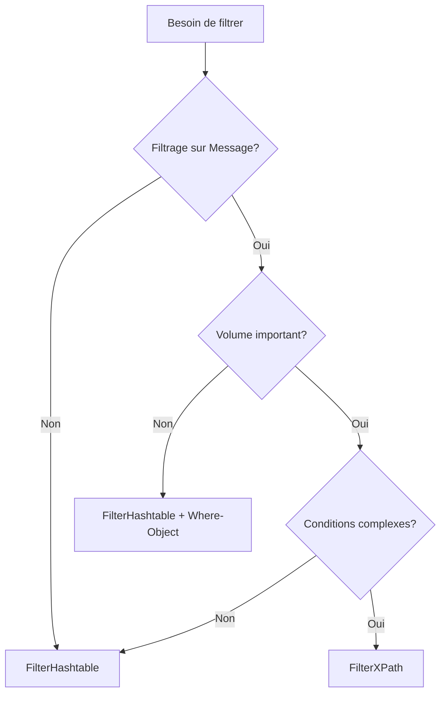

## 📑 Table des matières

```table-of-contents
title: 
style: nestedList # TOC style (nestedList|nestedOrderedList|inlineFirstLevel)
minLevel: 2 # Include headings from the specified level
maxLevel: 2 # Include headings up to the specified level
include: 
exclude: 
includeLinks: true # Make headings clickable
hideWhenEmpty: false # Hide TOC if no headings are found
debugInConsole: false # Print debug info in Obsidian console
```

---

## <a id="filterhash"></a>🎯 FilterHashtable - La méthode recommandée

### Pourquoi FilterHashtable ?

Le paramètre `-FilterHashtable` est **la méthode la plus performante** pour filtrer les événements Windows. Contrairement aux autres méthodes, il effectue le filtrage **côté serveur** avant de charger les événements en mémoire, ce qui réduit drastiquement la charge système et le temps de traitement.

> [!tip] Avantage clé Avec FilterHashtable, seuls les événements correspondants sont récupérés, au lieu de charger tous les événements puis de les filtrer en mémoire.

### Structure de base

```powershell
# Structure générale
Get-WinEvent -FilterHashtable @{
    LogName = 'Application'
    Id = 1000
    StartTime = (Get-Date).AddDays(-7)
}
```

La hashtable utilise des **paires clé-valeur** pour définir les critères de filtrage. Les clés sont prédéfinies par PowerShell.

### Clés disponibles

|Clé|Description|Type|Exemple|
|---|---|---|---|
|**LogName**|Nom du journal|String|'System', 'Application'|
|**ProviderName**|Source de l'événement|String|'Microsoft-Windows-PowerShell'|
|**Path**|Chemin vers fichier .evtx|String|'C:\Logs\archive.evtx'|
|**Keywords**|Mots-clés système|Long|0x8000000000000000|
|**Id**|Event ID|Int32|4624, 1000|
|**Level**|Niveau de gravité|Int32|1 (Critical), 2 (Error), 3 (Warning), 4 (Info)|
|**StartTime**|Début période|DateTime|(Get-Date).AddDays(-7)|
|**EndTime**|Fin période|DateTime|Get-Date|
|**UserID**|SID utilisateur|SecurityIdentifier|'S-1-5-21-...'|
|**Data**|Contenu données|String[]|'Spécifique au provider'|

> [!info] Valeurs Level
> 
> - **1** = Critical (Critique)
> - **2** = Error (Erreur)
> - **3** = Warning (Avertissement)
> - **4** = Information
> - **5** = Verbose (Détaillé)

### Exemples simples

```powershell
# Erreurs des 24 dernières heures
Get-WinEvent -FilterHashtable @{
    LogName = 'Application'
    Level = 2  # Erreurs uniquement
    StartTime = (Get-Date).AddDays(-1)
}

# Événements spécifiques par ID
Get-WinEvent -FilterHashtable @{
    LogName = 'Security'
    Id = 4624  # Connexions réussies
}

# Plusieurs journaux en même temps
Get-WinEvent -FilterHashtable @{
    LogName = 'Application', 'System'
    Level = 1, 2  # Critical et Error
}
```

### Exemples de filtres complexes

#### Surveillance de sécurité complète

```powershell
# Événements de connexion et déconnexion
Get-WinEvent -FilterHashtable @{
    LogName = 'Security'
    Id = 4624, 4634, 4647  # Logon, Logoff, User Logoff
    StartTime = (Get-Date).Date  # Depuis minuit
} | Select-Object TimeCreated, Id, Message -First 50
```

#### Analyse multi-sources

```powershell
# Erreurs critiques de plusieurs sources
Get-WinEvent -FilterHashtable @{
    LogName = 'Application'
    Level = 1, 2
    ProviderName = 'Application Error', 'Application Hang'
    StartTime = (Get-Date).AddHours(-6)
}
```

#### Filtrage par plage temporelle précise

```powershell
# Événements d'une journée spécifique
$debut = Get-Date "2024-12-15 08:00:00"
$fin = Get-Date "2024-12-15 18:00:00"

Get-WinEvent -FilterHashtable @{
    LogName = 'System'
    StartTime = $debut
    EndTime = $fin
    Level = 2, 3  # Errors et Warnings
}
```

> [!warning] Pièges courants
> 
> - Les valeurs doivent correspondre **exactement** au type attendu (Int32 pour Id, pas String)
> - Les noms de LogName sont sensibles à la casse
> - Impossible de filtrer sur le contenu du Message avec FilterHashtable

### Combinaison de critères

```powershell
# Filtrage multi-critères avancé
Get-WinEvent -FilterHashtable @{
    LogName = 'Security'
    Id = 4625  # Échecs de connexion
    Level = 4
    StartTime = (Get-Date).AddDays(-30)
} | Group-Object {$_.Properties[5].Value} | # Grouper par compte
    Sort-Object Count -Descending |
    Select-Object Count, Name -First 10
```

---

## <a id="filterxml"></a>🔍 FilterXPath et FilterXML

### Pourquoi utiliser XPath ?

XPath permet des **requêtes plus complexes** que FilterHashtable, notamment :

- Opérateurs logiques avancés (AND, OR, NOT)
- Filtrage sur le contenu des données structurées
- Conditions complexes sur plusieurs champs

> [!info] Performance FilterXPath offre également un filtrage côté serveur, donc de bonnes performances.

### Structure XPath de base

```powershell
# Syntaxe générale
Get-WinEvent -FilterXPath "
    *[System[
        Provider[@Name='NomProvider'] and
        (Level=1 or Level=2) and
        TimeCreated[@SystemTime>='2024-12-01T00:00:00.000Z']
    ]]
"
```

### Éléments de structure XML

Les événements Windows ont une structure XML standard :

```xml
<Event>
    <System>
        <Provider Name="..." />
        <EventID>1234</EventID>
        <Level>2</Level>
        <TimeCreated SystemTime="..." />
        <Computer>NomPC</Computer>
    </System>
    <EventData>
        <Data Name="param1">valeur1</Data>
        <Data Name="param2">valeur2</Data>
    </EventData>
</Event>
```

### Opérateurs XPath

|Opérateur|Description|Exemple|
|---|---|---|
|`and`|ET logique|`Level=2 and EventID=1000`|
|`or`|OU logique|`Level=1 or Level=2`|
|`not()`|Négation|`not(Level=4)`|
|`>=`, `<=`|Comparaisons|`EventID>=1000 and EventID<=2000`|
|`@Attribut`|Accès attribut|`Provider[@Name='...']`|

### Exemples XPath pratiques

#### Filtrage par plage d'ID

```powershell
# Événements avec ID entre 4624 et 4634
Get-WinEvent -LogName Security -FilterXPath "
    *[System[
        (EventID>=4624 and EventID<=4634)
    ]]
"
```

#### Conditions complexes avec OR

```powershell
# Erreurs OU warnings critiques
Get-WinEvent -LogName Application -FilterXPath "
    *[System[
        (Level=2) or
        (Level=3 and Provider[@Name='Application Error'])
    ]]
"
```

#### Filtrage sur données événement

```powershell
# Connexions d'un utilisateur spécifique
Get-WinEvent -LogName Security -FilterXPath "
    *[System[EventID=4624]] and
    *[EventData[Data[@Name='TargetUserName']='Administrator']]
"
```

> [!tip] Astuce : Trouver les noms de Data Pour connaître les noms des champs Data, récupérez un événement exemple et examinez sa structure :
> 
> ```powershell
> $event = Get-WinEvent -LogName Security -MaxEvents 1
> $event.ToXml()
> ```

### FilterXML - Requêtes structurées

Pour des requêtes encore plus complexes, utilisez FilterXML :

```powershell
$xmlQuery = @"
<QueryList>
  <Query Id="0" Path="Security">
    <Select Path="Security">
      *[System[
        (EventID=4624 or EventID=4625) and
        TimeCreated[@SystemTime>='2024-12-01T00:00:00.000Z']
      ]] and
      *[EventData[
        Data[@Name='LogonType']='2' or
        Data[@Name='LogonType']='10'
      ]]
    </Select>
  </Query>
</QueryList>
"@

Get-WinEvent -FilterXml $xmlQuery
```

> [!example] Cas d'usage FilterXML Idéal pour sauvegarder des requêtes complexes réutilisables ou créer des filtres depuis l'Observateur d'événements Windows (qui génère du XML).

### Création de requêtes depuis l'Observateur

1. Ouvrez l'Observateur d'événements Windows
2. Créez un filtre personnalisé via l'interface graphique
3. Onglet **XML** → Copiez la requête
4. Utilisez-la avec `-FilterXml`

```powershell
# Requête exportée de l'Observateur
$query = Get-Content "C:\Queries\SecurityFilter.xml" -Raw
Get-WinEvent -FilterXml $query
```

---

## <a id="whereobject"></a>⚙️ Filtrage avec Where-Object

### Quand utiliser Where-Object ?

Where-Object filtre **après récupération** des événements, ce qui le rend :

- ❌ **Moins performant** que FilterHashtable/XPath
- ✅ **Plus flexible** pour des conditions complexes
- ✅ **Capable de filtrer sur le Message**

> [!warning] Impact performance Where-Object charge TOUS les événements en mémoire avant de filtrer. À éviter pour de gros volumes.

### Syntaxe de base

```powershell
# Filtrage simple
Get-WinEvent -LogName Application -MaxEvents 1000 | 
    Where-Object { $_.LevelDisplayName -eq 'Error' }

# Syntaxe abrégée
Get-WinEvent -LogName Application -MaxEvents 1000 | 
    Where-Object LevelDisplayName -eq 'Error'
```

### Filtrage sur le Message

C'est le **principal avantage** de Where-Object :

```powershell
# Recherche dans le message
Get-WinEvent -LogName Application -MaxEvents 5000 | 
    Where-Object { $_.Message -like '*échec*' }

# Recherche de mot exact
Get-WinEvent -LogName System -MaxEvents 2000 | 
    Where-Object { $_.Message -match 'service.*arrêté' }
```

### Conditions multiples

```powershell
# Plusieurs critères combinés
Get-WinEvent -LogName Security -MaxEvents 10000 | 
    Where-Object {
        $_.Id -eq 4625 -and
        $_.TimeCreated -gt (Get-Date).AddHours(-24) -and
        $_.Message -like '*Administrator*'
    }
```

### Opérateurs de comparaison

|Opérateur|Description|Exemple|
|---|---|---|
|`-eq`|Égal|`$_.Id -eq 1000`|
|`-ne`|Différent|`$_.Level -ne 4`|
|`-gt`, `-ge`|Supérieur (ou égal)|`$_.Id -gt 4000`|
|`-lt`, `-le`|Inférieur (ou égal)|`$_.TimeCreated -lt (Get-Date)`|
|`-like`|Correspondance pattern|`$_.Message -like '*error*'`|
|`-match`|Expression régulière|`$_.Message -match '\d{3}-\d{3}'`|
|`-contains`|Contient élément|`$_.Properties -contains 'valeur'`|
|`-in`|Présent dans liste|`$_.Id -in 1000,2000,3000`|

### Combinaison intelligente

Pour optimiser, **combinez** FilterHashtable et Where-Object :

```powershell
# D'abord filtrage côté serveur (rapide)
# Puis filtrage message (lent mais nécessaire)
Get-WinEvent -FilterHashtable @{
    LogName = 'Application'
    Level = 2
    StartTime = (Get-Date).AddDays(-7)
} | Where-Object { $_.Message -match 'database|connexion' }
```

> [!tip] Bonne pratique Réduisez d'abord le volume avec FilterHashtable, puis affinez avec Where-Object si besoin.

---

## <a id="patterns"></a>🔎 Recherche de patterns

### Expressions régulières de base

Les regex permettent des recherches sophistiquées dans les messages :

```powershell
# Adresses IP
Get-WinEvent -LogName Security -MaxEvents 5000 | 
    Where-Object { $_.Message -match '\b\d{1,3}\.\d{1,3}\.\d{1,3}\.\d{1,3}\b' }

# Adresses email
Get-WinEvent -LogName Application -MaxEvents 3000 | 
    Where-Object { $_.Message -match '\b[\w\.-]+@[\w\.-]+\.\w+\b' }

# Chemins de fichiers Windows
Get-WinEvent -LogName System -MaxEvents 2000 | 
    Where-Object { $_.Message -match '[A-Z]:\\(?:[^\\/:*?"<>|\r\n]+\\)*[^\\/:*?"<>|\r\n]*' }
```

### Patterns de sécurité courants

```powershell
# Tentatives d'élévation de privilèges
Get-WinEvent -FilterHashtable @{
    LogName = 'Security'
    Id = 4672, 4673, 4674
    StartTime = (Get-Date).AddDays(-1)
} | Where-Object { 
    $_.Message -match 'Administrator|SYSTEM|SeDebugPrivilege'
}

# Connexions hors heures ouvrables
Get-WinEvent -FilterHashtable @{
    LogName = 'Security'
    Id = 4624
    StartTime = (Get-Date).Date
} | Where-Object {
    $_.TimeCreated.Hour -lt 7 -or $_.TimeCreated.Hour -gt 19
}

# Connexions depuis IPs suspectes
$suspiciousIPs = '10.0.0.50', '192.168.1.100'
Get-WinEvent -LogName Security -MaxEvents 10000 | 
    Where-Object {
        $ip = $_.Properties[18].Value  # Index dépend de l'événement
        $ip -in $suspiciousIPs
    }
```

### Recherche de mots-clés multiples

```powershell
# Liste de mots-clés à surveiller
$keywords = 'fail', 'error', 'critical', 'denied', 'timeout'

Get-WinEvent -FilterHashtable @{
    LogName = 'Application'
    Level = 2, 3
    StartTime = (Get-Date).AddHours(-6)
} | Where-Object {
    $message = $_.Message.ToLower()
    $keywords | ForEach-Object { 
        if ($message -like "*$_*") { return $true }
    }
}
```

### Extraction d'informations

```powershell
# Extraire les codes d'erreur
Get-WinEvent -LogName Application -MaxEvents 1000 | 
    Where-Object { $_.Message -match 'Error code: (\d+)' } |
    ForEach-Object {
        [PSCustomObject]@{
            Time = $_.TimeCreated
            ErrorCode = $matches[1]
            Source = $_.ProviderName
        }
    }
```

> [!example] Utilisation de $matches Avec `-match`, les groupes capturés `()` sont disponibles dans la variable automatique `$matches`.

---

## <a id="usecases"></a>💼 Cas d'usage pratiques

### Erreurs d'application

```powershell
# Identifier les applications problématiques
Get-WinEvent -FilterHashtable @{
    LogName = 'Application'
    Level = 2  # Erreurs
    StartTime = (Get-Date).AddDays(-7)
} | Group-Object ProviderName | 
    Sort-Object Count -Descending | 
    Select-Object Count, Name -First 10 |
    Format-Table -AutoSize
```

### Événements de sécurité - Connexions

```powershell
# Analyse des connexions réussies
Get-WinEvent -FilterHashtable @{
    LogName = 'Security'
    Id = 4624  # Logon réussi
    StartTime = (Get-Date).Date
} | ForEach-Object {
    [PSCustomObject]@{
        Time = $_.TimeCreated
        User = $_.Properties[5].Value
        LogonType = $_.Properties[8].Value
        SourceIP = $_.Properties[18].Value
        Workstation = $_.Properties[11].Value
    }
} | Format-Table -AutoSize

# Types de connexion :
# 2 = Interactive (console locale)
# 3 = Network (partage réseau)
# 10 = RemoteInteractive (RDP)
```

### Événements de sécurité - Échecs de connexion

```powershell
# Détection d'attaques par force brute
$failedLogins = Get-WinEvent -FilterHashtable @{
    LogName = 'Security'
    Id = 4625  # Échec connexion
    StartTime = (Get-Date).AddHours(-1)
}

$failedLogins | Group-Object {$_.Properties[5].Value} | 
    Where-Object Count -gt 5 | 
    Sort-Object Count -Descending |
    Select-Object @{N='Tentatives';E={$_.Count}}, 
                  @{N='Compte';E={$_.Name}} |
    Format-Table -AutoSize
```

### Événements système - Redémarrages

```powershell
# Historique des redémarrages
Get-WinEvent -FilterHashtable @{
    LogName = 'System'
    Id = 1074, 1076, 6005, 6006, 6008
    # 1074 = Shutdown initié par app
    # 1076 = Shutdown suivant
    # 6005 = Service event log démarré
    # 6006 = Service event log arrêté
    # 6008 = Arrêt inattendu
} | Select-Object TimeCreated, Id, Message -First 20
```

### Événements système - Services

```powershell
# Services arrêtés ou en échec
Get-WinEvent -FilterHashtable @{
    LogName = 'System'
    ProviderName = 'Service Control Manager'
    Level = 2, 3
    StartTime = (Get-Date).AddDays(-1)
} | Where-Object { 
    $_.Message -match 'arrêt|stopped|failed|échec' 
} | Select-Object TimeCreated, Message
```

### Audit et conformité

```powershell
# Modifications de comptes utilisateurs
Get-WinEvent -FilterHashtable @{
    LogName = 'Security'
    Id = 4720, 4722, 4723, 4724, 4725, 4726, 4738
    # 4720 = Compte créé
    # 4722 = Compte activé
    # 4723 = Changement mot de passe tenté
    # 4724 = Réinitialisation mot de passe
    # 4725 = Compte désactivé
    # 4726 = Compte supprimé
    # 4738 = Compte modifié
    StartTime = (Get-Date).AddDays(-30)
} | Select-Object TimeCreated, Id, 
    @{N='Action';E={
        switch ($_.Id) {
            4720 {'Compte créé'}
            4722 {'Compte activé'}
            4723 {'MDP changé (tenté)'}
            4724 {'MDP réinitialisé'}
            4725 {'Compte désactivé'}
            4726 {'Compte supprimé'}
            4738 {'Compte modifié'}
        }
    }},
    @{N='Compte';E={$_.Properties[0].Value}}
```

### Détection d'incidents

```powershell
# Surveillance des événements critiques en temps réel
$criticalEvents = @{
    LogName = 'Security', 'System', 'Application'
    Level = 1, 2  # Critical et Error
    StartTime = (Get-Date).AddMinutes(-5)
}

while ($true) {
    $events = Get-WinEvent -FilterHashtable $criticalEvents -ErrorAction SilentlyContinue
    
    if ($events) {
        $events | ForEach-Object {
            Write-Host "⚠️ ALERTE : $($_.TimeCreated)" -ForegroundColor Red
            Write-Host "Source : $($_.ProviderName)" -ForegroundColor Yellow
            Write-Host "Message : $($_.Message)`n" -ForegroundColor White
        }
    }
    
    Start-Sleep -Seconds 60
    $criticalEvents.StartTime = (Get-Date).AddMinutes(-5)
}
```

### Corrélation d'événements

```powershell
# Corréler échecs de connexion et verrouillages de compte
$lockouts = Get-WinEvent -FilterHashtable @{
    LogName = 'Security'
    Id = 4740  # Compte verrouillé
    StartTime = (Get-Date).AddHours(-24)
}

foreach ($lockout in $lockouts) {
    $accountName = $lockout.Properties[0].Value
    $lockTime = $lockout.TimeCreated
    
    # Rechercher échecs précédents
    $priorFailures = Get-WinEvent -FilterHashtable @{
        LogName = 'Security'
        Id = 4625
        StartTime = $lockTime.AddMinutes(-10)
        EndTime = $lockTime
    } | Where-Object { $_.Properties[5].Value -eq $accountName }
    
    [PSCustomObject]@{
        Compte = $accountName
        HeureVerrouillage = $lockTime
        TentativesEchec = $priorFailures.Count
        SourcesIP = ($priorFailures.Properties[19].Value | Select-Object -Unique) -join ', '
    }
}
```

---

## <a id="export"></a>📤 Export et reporting

### Export vers CSV

```powershell
# Export simple
Get-WinEvent -FilterHashtable @{
    LogName = 'Application'
    Level = 2
    StartTime = (Get-Date).AddDays(-7)
} | Select-Object TimeCreated, LevelDisplayName, ProviderName, Id, Message |
    Export-Csv -Path "C:\Logs\Erreurs_Application.csv" -NoTypeInformation -Encoding UTF8

# Export structuré avec sélection de propriétés
Get-WinEvent -FilterHashtable @{
    LogName = 'Security'
    Id = 4624
    StartTime = (Get-Date).Date
} | Select-Object @{N='Date';E={$_.TimeCreated}},
                  @{N='Utilisateur';E={$_.Properties[5].Value}},
                  @{N='TypeConnexion';E={$_.Properties[8].Value}},
                  @{N='SourceIP';E={$_.Properties[18].Value}} |
    Export-Csv -Path "C:\Logs\Connexions_$(Get-Date -Format 'yyyyMMdd').csv" -NoTypeInformation
```

### Export vers HTML

```powershell
# Rapport HTML formaté
$events = Get-WinEvent -FilterHashtable @{
    LogName = 'System'
    Level = 1, 2
    StartTime = (Get-Date).AddDays(-1)
}

$html = $events | Select-Object TimeCreated, LevelDisplayName, ProviderName, Id, Message |
    ConvertTo-Html -Title "Rapport Événements Critiques" -PreContent "<h1>Événements Système - $(Get-Date -Format 'dd/MM/yyyy')</h1>" |
    Out-String

# Ajouter du CSS
$css = @"
<style>
    body { font-family: Arial, sans-serif; }
    table { border-collapse: collapse; width: 100%; }
    th { background-color: #4CAF50; color: white; padding: 10px; }
    td { border: 1px solid #ddd; padding: 8px; }
    tr:nth-child(even) { background-color: #f2f2f2; }
</style>
"@

$html = $html -replace '<head>', "<head>$css"
$html | Out-File -FilePath "C:\Logs\Rapport_$(Get-Date -Format 'yyyyMMdd').html"
```

### Rapports automatisés

```powershell
# Script de rapport quotidien
$date = Get-Date
$logPath = "C:\Logs\Rapports"

# Créer dossier si nécessaire
if (-not (Test-Path $logPath)) {
    New-Item -Path $logPath -ItemType Directory
}

# Collecter les erreurs
$erreurs = Get-WinEvent -FilterHashtable @{
    LogName = 'Application', 'System'
    Level = 1, 2
    StartTime = $date.AddDays(-1)
} | Select-Object TimeCreated, LogName, LevelDisplayName, ProviderName, Id, Message

# Statistiques
$stats = [PSCustomObject]@{
    Date = $date.ToString('dd/MM/yyyy')
    TotalErreurs = $erreurs.Count
    Critiques = ($erreurs | Where-Object LevelDisplayName -eq 'Critical').Count
    Erreurs = ($erreurs | Where-Object LevelDisplayName -eq 'Error').Count
    TopSource = ($erreurs | Group-Object ProviderName | Sort-Object Count -Descending | Select-Object -First 1).Name
}

# Export
$stats | Export-Csv -Path "$logPath\Stats_$(Get-Date -Format 'yyyyMMdd').csv" -NoTypeInformation -Append
$erreurs | Export-Csv -Path "$logPath\Erreurs_$(Get-Date -Format 'yyyyMMdd').csv" -NoTypeInformation
```

> [!tip] Planification Planifiez ce script via le Planificateur de tâches Windows pour des rapports automatiques.

### Archivage de journaux

```powershell
# Exporter et archiver les journaux
$archivePath = "C:\Archives\EventLogs"
$date = Get-Date -Format "yyyyMMdd"

if (-not (Test-Path $archivePath)) {
    New-Item -Path $archivePath -ItemType Directory
}

# Exporter les journaux au format EVTX
$logs = 'Application', 'System', 'Security'

foreach ($log in $logs) {
    $destination = "$archivePath\${log}_$date.evtx"
    wevtutil epl $log $destination
    
    Write-Host "✓ Journal $log exporté vers $destination" -ForegroundColor Green
}

# Compresser les archives de plus de 7 jours
Get-ChildItem $archivePath -Filter "*.evtx" | 
    Where-Object LastWriteTime -lt (Get-Date).AddDays(-7) |
    ForEach-Object {
        Compress-Archive -Path $_.FullName -DestinationPath "$($_.FullName).zip" -Force
        Remove-Item $_.FullName
    }
```

---

## <a id="remote"></a>🌐 Journaux distants

### Paramètre -ComputerName

```powershell
# Interroger une machine distante
Get-WinEvent -ComputerName "SERVEUR01" -FilterHashtable @{
    LogName = 'System'
    Level = 2
    StartTime = (Get-Date).AddHours(-6)
}

# Interroger plusieurs machines
$servers = 'SRV01', 'SRV02', 'SRV03'

$servers | ForEach-Object {
    Get-WinEvent -ComputerName $_ -FilterHashtable @{
        LogName = 'Application'
        Level = 1, 2
        StartTime = (Get-Date).AddDays(-1)
    } | Select-Object @{N='Serveur';E={$_}}, TimeCreated, ProviderName, Id, Message
}
```

### Droits nécessaires

> [!warning] Prérequis Pour interroger des journaux distants, vous devez :
> 
> - Être membre du groupe **Event Log Readers** sur la machine distante
> - OU être Administrateur local de la machine distante
> - Avoir WinRM activé et configuré

### Configuration WinRM

```powershell
# Sur la machine distante : activer WinRM
Enable-PSRemoting -Force

# Vérifier le service
Get-Service WinRM

# Configurer le pare-feu (si nécessaire)
Set-NetFirewallRule -Name "WINRM-HTTP-In-TCP" -Enabled True

# Tester la connectivité depuis la machine source
Test-WSMan -ComputerName "SERVEUR01"
```

### Gestion des informations d'identification

```powershell
# Utiliser des credentials explicites
$cred = Get-Credential -Message "Entrez les identifiants administrateur"

Get-WinEvent -ComputerName "SERVEUR01" -Credential $cred -FilterHashtable @{
    LogName = 'Security'
    Id = 4625
    StartTime = (Get-Date).AddHours(-1)
}

# Stocker les credentials de manière sécurisée
$cred = Get-Credential
$cred | Export-Clixml -Path "C:\Secure\creds.xml"

# Réutiliser plus tard
$cred = Import-Clixml -Path "C:\Secure\creds.xml"
Get-WinEvent -ComputerName "SERVEUR01" -Credential $cred -LogName Application
```

> [!warning] Sécurité Les credentials exportés avec Export-Clixml sont chiffrés avec le profil de l'utilisateur. Ils ne peuvent être importés que par le même utilisateur sur la même machine.

### Collecte centralisée

```powershell
# Script de collecte multi-serveurs
$servers = Get-Content "C:\Scripts\servers.txt"
$results = @()

foreach ($server in $servers) {
    try {
        $events = Get-WinEvent -ComputerName $server -FilterHashtable @{
            LogName = 'System'
            Level = 1, 2
            StartTime = (Get-Date).AddHours(-24)
        } -ErrorAction Stop
        
        $results += $events | Select-Object @{N='Serveur';E={$server}}, 
                                           TimeCreated, 
                                           LevelDisplayName, 
                                           ProviderName, 
                                           Id, 
                                           Message
        
        Write-Host "✓ $server : $($events.Count) événements collectés" -ForegroundColor Green
    }
    catch {
        Write-Host "✗ $server : Erreur - $($_.Exception.Message)" -ForegroundColor Red
    }
}

# Export consolidé
$results | Export-Csv -Path "C:\Logs\Collecte_$(Get-Date -Format 'yyyyMMdd_HHmmss').csv" -NoTypeInformation
```

### Utilisation de PSSession pour performances

```powershell
# Pour de nombreuses requêtes sur la même machine, utilisez PSSession
$session = New-PSSession -ComputerName "SERVEUR01"

# Exécuter plusieurs requêtes dans la même session
Invoke-Command -Session $session -ScriptBlock {
    # Requête 1
    $app = Get-WinEvent -FilterHashtable @{
        LogName = 'Application'
        Level = 2
        StartTime = (Get-Date).AddDays(-1)
    }
    
    # Requête 2
    $sys = Get-WinEvent -FilterHashtable @{
        LogName = 'System'
        Level = 2
        StartTime = (Get-Date).AddDays(-1)
    }
    
    # Retourner les résultats
    [PSCustomObject]@{
        ApplicationErrors = $app.Count
        SystemErrors = $sys.Count
        Events = $app + $sys
    }
}

# Fermer la session
Remove-PSSession $session
```

---

## <a id="performance"></a>⚡ Performance et bonnes pratiques

### Règle d'or : Filtrer côté serveur

> [!tip] Principe fondamental **Toujours** utiliser FilterHashtable ou FilterXPath pour filtrer côté serveur. Where-Object doit être un dernier recours.

```powershell
# ❌ MAUVAIS : Charge tout en mémoire puis filtre
Get-WinEvent -LogName Security -MaxEvents 100000 | 
    Where-Object { $_.Id -eq 4624 }

# ✅ BON : Filtre côté serveur
Get-WinEvent -FilterHashtable @{
    LogName = 'Security'
    Id = 4624
}
```

**Impact de performance :**

- Méthode mauvaise : ~30 secondes, 500 MB RAM
- Méthode bonne : ~2 secondes, 50 MB RAM

### Limiter le nombre d'événements

```powershell
# Toujours limiter avec -MaxEvents si pas de filtre temporel
Get-WinEvent -LogName Application -MaxEvents 1000

# Ou utiliser StartTime/EndTime
Get-WinEvent -FilterHashtable @{
    LogName = 'Application'
    StartTime = (Get-Date).AddHours(-6)
}

# Combinaison des deux pour sécurité
Get-WinEvent -FilterHashtable @{
    LogName = 'Security'
    StartTime = (Get-Date).AddDays(-30)
} -MaxEvents 10000
```

> [!warning] Attention aux gros volumes Le journal Security peut contenir des millions d'événements. Sans limite, votre script peut consommer toute la RAM disponible.

### Éviter de charger trop en mémoire

```powershell
# ❌ MAUVAIS : Charge tout d'un coup
$events = Get-WinEvent -LogName Security -MaxEvents 100000
foreach ($event in $events) {
    # Traitement...
}

# ✅ BON : Traitement par lots
$batchSize = 1000
$skip = 0

do {
    $events = Get-WinEvent -LogName Security -MaxEvents $batchSize -Skip $skip
    
    foreach ($event in $events) {
        # Traitement événement par événement
        Process-Event $event
    }
    
    $skip += $batchSize
} while ($events.Count -eq $batchSize)
```

### Utiliser des index temporels

```powershell
# ✅ OPTIMAL : Fenêtre temporelle précise
Get-WinEvent -FilterHashtable @{
    LogName = 'Application'
    Level = 2
    StartTime = (Get-Date).Date  # Début de journée
    EndTime = (Get-Date).Date.AddHours(9)  # Jusqu'à 9h
}

# Index temporel sur plusieurs critères
$morning = Get-WinEvent -FilterHashtable @{
    LogName = 'Security'
    StartTime = (Get-Date).Date.AddHours(6)
    EndTime = (Get-Date).Date.AddHours(12)
}

$afternoon = Get-WinEvent -FilterHashtable @{
    LogName = 'Security'
    StartTime = (Get-Date).Date.AddHours(12)
    EndTime = (Get-Date).Date.AddHours(18)
}
```

### Optimisation des requêtes complexes

```powershell
# ❌ MAUVAIS : Plusieurs appels séparés
$errors = Get-WinEvent -FilterHashtable @{LogName='Application'; Level=2}
$warnings = Get-WinEvent -FilterHashtable @{LogName='Application'; Level=3}
$critical = Get-WinEvent -FilterHashtable @{LogName='Application'; Level=1}
$all = $errors + $warnings + $critical

# ✅ BON : Un seul appel avec plusieurs niveaux
$all = Get-WinEvent -FilterHashtable @{
    LogName = 'Application'
    Level = 1, 2, 3
}
```

### Gestion des erreurs

```powershell
# Toujours gérer les erreurs potentielles
try {
    $events = Get-WinEvent -FilterHashtable @{
        LogName = 'Application'
        StartTime = (Get-Date).AddDays(-7)
    } -ErrorAction Stop
    
    Write-Host "✓ $($events.Count) événements récupérés" -ForegroundColor Green
}
catch [System.Exception] {
    if ($_.Exception.Message -like "*No events were found*") {
        Write-Host "ℹ Aucun événement trouvé pour les critères spécifiés" -ForegroundColor Yellow
    }
    else {
        Write-Host "✗ Erreur : $($_.Exception.Message)" -ForegroundColor Red
    }
}

# Utiliser -ErrorAction SilentlyContinue pour ignorer les erreurs
$events = Get-WinEvent -LogName Application -MaxEvents 100 -ErrorAction SilentlyContinue
```

### Paramètres de performance

```powershell
# Désactiver la progression pour scripts automatisés
$ProgressPreference = 'SilentlyContinue'
Get-WinEvent -FilterHashtable @{LogName='Security'; Id=4624}
$ProgressPreference = 'Continue'

# Utiliser -Oldest pour parcourir chronologiquement
Get-WinEvent -FilterHashtable @{
    LogName = 'System'
    StartTime = (Get-Date).AddDays(-7)
} -Oldest -MaxEvents 100
```

### Mesure de performance

```powershell
# Comparer différentes approches
Measure-Command {
    Get-WinEvent -LogName Application -MaxEvents 10000 | 
        Where-Object Id -eq 1000
}

Measure-Command {
    Get-WinEvent -FilterHashtable @{
        LogName = 'Application'
        Id = 1000
    } -MaxEvents 10000
}

# Profiler une requête complète
$stopwatch = [System.Diagnostics.Stopwatch]::StartNew()

$events = Get-WinEvent -FilterHashtable @{
    LogName = 'Security'
    StartTime = (Get-Date).AddDays(-1)
}

$stopwatch.Stop()
Write-Host "Temps d'exécution : $($stopwatch.Elapsed.TotalSeconds) secondes"
Write-Host "Événements récupérés : $($events.Count)"
Write-Host "Vitesse : $([math]::Round($events.Count / $stopwatch.Elapsed.TotalSeconds, 2)) événements/sec"
```

### Mise en cache intelligente

```powershell
# Cache simple pour requêtes répétées
$script:EventCache = @{}
$cacheTimeout = New-TimeSpan -Minutes 5

function Get-CachedEvents {
    param(
        [string]$LogName,
        [int]$Level
    )
    
    $cacheKey = "$LogName-$Level"
    
    if ($script:EventCache.ContainsKey($cacheKey)) {
        $cached = $script:EventCache[$cacheKey]
        
        if ((Get-Date) - $cached.Timestamp -lt $cacheTimeout) {
            Write-Host "ℹ Utilisation du cache" -ForegroundColor Cyan
            return $cached.Events
        }
    }
    
    # Récupérer les événements
    $events = Get-WinEvent -FilterHashtable @{
        LogName = $LogName
        Level = $Level
        StartTime = (Get-Date).AddHours(-1)
    }
    
    # Stocker en cache
    $script:EventCache[$cacheKey] = @{
        Events = $events
        Timestamp = Get-Date
    }
    
    return $events
}

# Utilisation
$errors1 = Get-CachedEvents -LogName 'Application' -Level 2
$errors2 = Get-CachedEvents -LogName 'Application' -Level 2  # Depuis le cache
```

### Bonnes pratiques récapitulatives

|Pratique|Description|Impact|
|---|---|---|
|**FilterHashtable prioritaire**|Toujours filtrer côté serveur|⚡⚡⚡ Très élevé|
|**Limiter MaxEvents**|Ne jamais charger sans limite|⚡⚡⚡ Très élevé|
|**StartTime/EndTime**|Utiliser des fenêtres temporelles|⚡⚡ Élevé|
|**Traitement par lots**|Pour gros volumes, traiter par paquets|⚡⚡ Élevé|
|**Gestion erreurs**|Try/Catch ou -ErrorAction|⚡ Moyen|
|**Un seul appel**|Grouper critères similaires|⚡ Moyen|
|**Cache intelligent**|Pour requêtes répétées|⚡ Moyen|
|**$ProgressPreference**|Désactiver pour scripts auto|⚡ Faible|

> [!example] Modèle optimal complet
> 
> ```powershell
> # Template de requête optimale
> try {
>     $events = Get-WinEvent -FilterHashtable @{
>         LogName = 'Security'
>         Id = 4624, 4625
>         Level = 4
>         StartTime = (Get-Date).AddHours(-6)
>     } -MaxEvents 5000 -ErrorAction Stop
>     
>     # Filtrage additionnel si nécessaire
>     $filtered = $events | Where-Object { 
>         $_.Message -match 'pattern_specifique' 
>     }
>     
>     Write-Host "✓ $($filtered.Count) événements traités" -ForegroundColor Green
> }
> catch {
>     Write-Host "✗ Erreur : $($_.Exception.Message)" -ForegroundColor Red
> }
> ```

---

## 🎓 Résumé des concepts clés

### Choix de la méthode de filtrage



### Hiérarchie de performance

1. 🥇 **FilterHashtable** - Rapide, simple, côté serveur
2. 🥈 **FilterXPath** - Rapide, flexible, côté serveur
3. 🥉 **FilterXML** - Rapide, très flexible, côté serveur
4. 🐌 **Where-Object** - Lent, après récupération, mais accès au Message

### Points essentiels à retenir

> [!info] Synthèse
> 
> - ✅ **Toujours filtrer côté serveur** avec FilterHashtable ou XPath
> - ✅ **Limiter le nombre d'événements** avec MaxEvents ou fenêtres temporelles
> - ✅ **Gérer les erreurs** systématiquement (journaux vides, accès refusé)
> - ✅ **Combiner intelligemment** les méthodes de filtrage
> - ✅ **Optimiser pour la distance** : PSSession pour requêtes multiples distantes
> - ⚠️ **Attention aux volumes** : Le journal Security peut être énorme
> - 💾 **Archiver régulièrement** les journaux pour libérer de l'espace

---

_Cours PowerShell - Journaux d'événements : Filtrage et recherche | Version 1.0_